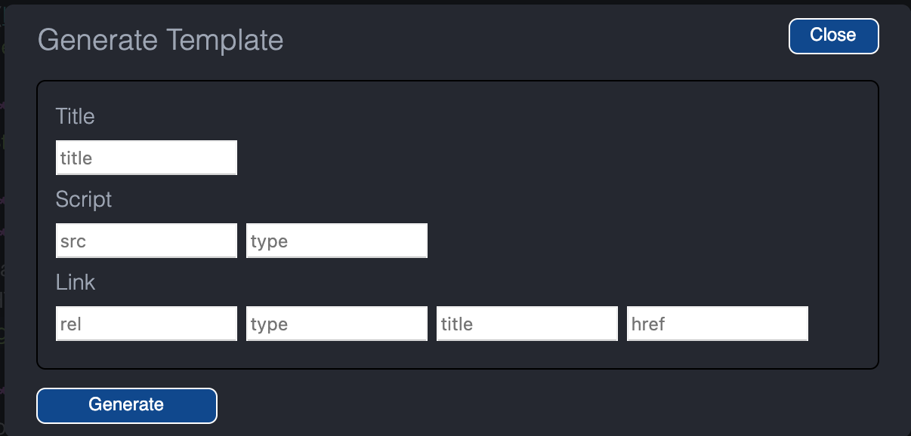

<h1 class="capitalize">COMD2451</h1>
<h2 class="capitalize center">How to create a responsive HTML5 Resume</h2>

---

<section class="section">
	<h2 class="sentence">Inspiration for the Résumé Page</h2>

I ***found*** a ***very nice*** `responsive HTML5 résumé` on `Codepen` that I ***think*** will be a ***great structure*** and ***design*** to `emulate` in our `portfolio site`. I am **making** *SOME* **modifications** that will ***make*** the `resume` ***more semantic***, but I ***love*** the ***look***.
To ***view*** this `resume` on `Codepen`, please ***visit*** [HTML5 Resume: Jared Pearce](https://codepen.io/jaredpearce/pen/iBdxb) on `Codepen`.

</section>

---

<section class="section">
	<h2 class="sentence">Creating The HTML5 Skeleton</h2>

The ***first thing*** we ***have*** to ***do*** before ***anything else***, is to ***create*** our `HTML5 skeleton` with the `Brackets HTML Skeleton` ***extension***.

**Reminder**: Since I found out that `Adobe Brackets` has been ***deprecated***, I have ***switched over*** to [Atom](https://atom.io/), because it has **much** of the ***same feel*** as `Adobe Brackets` did. I thought maybe you would like to **keep** that "feel" ***with you***.

I have **created** a `slide deck` called [Atom Installation and Setup](https://github.com/interglobalmedia/atom-installation-setup/blob/master/atom-installation-setup.md) `slide deck` which I **hosted** on `Github`. There, I include `extensions` you should ***add*** to `Atom`. **Saving** new `files` and `folders` ***follow*** the `same process` in `Atom`, so you can ***still refer*** to the [Installing and Setting up Brackets
](https://github.com/interglobalmedia/brackets-installation-setup/blob/master/brackets-installation-setup.md) `slide deck`. If, ***however***, you have ***opted*** for `VS Code`, that is fine too!

***Under*** `Elements`, ***inside*** the `HTML5 Skeleton` ***modal***, ***select*** `Basic HTML Skeleton` and `External Stylesheet`. Then ***click*** `Done`.

***Next***, make sure to ***fill in*** the ***value*** of the `html element`'s `lang` ***attribute*** with `"en"` ***inside*** the ***empty*** `double quotes` (`""`) which is ***located*** in the `opening tag` of the `html element`. If you have ***opted*** for `Atom`, it will just be a ***matter*** of **deleting** `HTML markup` that you ***don't initially*** **need**. To **create** an `HTML`(5) `Skeleton` with `Atom`, ***select*** the `Atom` **menu tab** called `Packages`, then ***select*** `HTML Template Generator`, and then `generate HTML Template`. An `HTML Template Generator popup` will **appear**:

<div>
	
</div>

Simply ***click*** the `"Generate"` **button**, and it will **create** an `HTML "template"` for you in your **current active** `HTML` **file**.

***Next***, make sure to ***add*** `content` to the `title element` ***inside*** the `head` of the `HTML document`. I for ***instance***, would do the ***following***:

```html
<title>Maria D. Campbell's Responsive HTML5 Developer Resumé</title>
```

***Next***, we `have` to ***move*** the ***inserted*** `link element` which will ***point*** to our `external stylesheet` into the `head` of the `HTML document`, and ***place it*** `under` the `title element`.

The ***cool thing*** about `Atom` is that it will **include** the `dir` **attribute** with a `value` of `"ltr"` **inside** the `opening tag` of the `html element`. So if any of you are ***into*** `Writing Modes`, you **might want** to **use** `Atom`!

</section>

---

<section class="section">
	<h2 class="sentence">Creating the Intro Section of the Résumé</h2>

I am **assuming** that you have ***already created***

+ your `HTML skeleton`, which should ***include*** your `<!DOCTYPE html>` declaration,

+ ***followed by*** an `opening HTML tag` **containing** the `lang attribute` **with** the `value` of `"en"`,

+ then your `head element` which **should contain** a `meta charset element`, a `meta viewport element`, a `title element`, and an `external resource link element` **containing** the `path` to your **external** `CSS` **file**,

+ an **opening** and **closing** `body tag`

So **right now** your `resume.html` **page** should look **something like** the ***following***:

```html5
<!DOCTYPE html>
<html lang="en"
	  dir="ltr">

<head>
	<meta charset="utf-8">
	<meta name="viewport"
		  content="width=device-width, initial-scale=1.0">
	<meta name="description"
		  content="Maria D. Campbell's Online Portfolio Site, Web Developer and Web Development Teaching Resume">
	<meta name="keywords"
		  content="Babel JavaScript Compiler, CSS, CSS3, CSS Flexbox, Command Line Interface, CSS Grid, Embedded JavaScript (EJS), ECMAScript 6 Plus, ES6 Modules, Express.js, Final Cut Pro, Git, Github, Heroku
, Final Cut Pro, Git. Github, Heroku, HTML5, JetBrains, Jira, Modern JavaScript, MongoDB, Netlify, Netlify CMS, Node.js, NPM, PostreSQL, Python 3.8+, React, SASS (SCSS), Webpack, WordPress">
	<meta name="
		  Author"
		  content="Maria D. Campbell">
	<title>Maria Campbell's Online Résumé</title>
	<link rel="stylesheet"
		  href="styles/resume.css">
</head>

<body>

</body>
</html>
```

If you are **using** `Atom` and **something like** a `div element` has been **added** between the `opening` and `closing body tags`, **remove it**. We don't need it. It is a ***completely*** `un-semantic element` that should be ***avoided***. There is a **time** and **place** for it, but ***not here***.

The ***first thing*** we ***have*** to ***do*** is to ***create*** an ***introduction area*** at the ***top*** of the `resume`, ***describing*** a **bit** about ***ourselves***. ***Before*** we ***do that***, ***however***, we ***add*** the `main element`, which will ***wrap around*** the ***whole content*** of the `resume`. ***Something*** like ***this***:

```html5
<body>
	<main>

	</main>
</body>
```

***Next***, we can ***add*** a `div element` with a `"page"` ***class*** which acts as a `wrapper` **around** our **content**, and **where** we will ***add styling*** that will make our `resume` look like an ***actual*** `page/piece` of `paper`.

```html5
<body>
	<main>
		<div class="page">
		</div>
	</main>
</body>
```

I am ***not concerned*** about whether or not the `div element` is **semantic**. It is added ***solely*** for `styling purposes`.

***Next***, ***inside*** the `div element` ***with*** the `class` of `"page"`, we can ***add*** `something like` the ***following***:

```html5
<body>
<main>
	<div class="page">
	<header>
		<h1><a href="index.html">Maria D. Campbell</a></h1>
		<h2>Full Stack Developer</h2>
		<p>Full Stack Developer who is passionate about designing,
			developing, and teaching
			experiences that make people's lives simpler. Specialty
			is to help sharpen the thinking of individuals
			in approaching their workflows in a more organized and
			efficient manner, thereby preparing them for jobs in Web
			Design and Development.</p>
	</header>
		</div>
	</main>
</body>
```

I **add** an `a element` to the `h1` ***inside*** the `header element` so that a **user** can `click` on it to **easily** and **quickly** ***return*** to the `home page` (`index.html`) **instead of** having to **scroll** all the way **down** to the ***bottom*** of the `page`. However, there is a `footer navigation` available that **links** to **all** the **pages** on the `site` as well.

</section>

---

<section class="section">
	<h2 class="sentence">The Professional Experience Section</h2>

**Next**, **below** the `closing header tag`, I **add** an `opening section tag` with the **class** of `"professional_experience"`. Then I **create** a `closing section tag`. Then, **making sure** that the `cursor` is ***placed between*** the `opening` and `closing section tags`, I **press** the `return key` to **take** the `closing section tag` to the **next line**.

**Below** the `opening section tag` with the **class** of ``"professional_experience"``, I **add** an `opening article tag`. Then I **create** a `closing article tag`. Then, **making sure** that the `cursor` is **placed between** the `opening` and `closing article tags`, I **press** the `return key` to **take** the `closing article tag` to the **next line**.

**Below** the `opening article tag`, I **add** an `h2 element` with the `text content` of `"Professional Experience"`.

***Right now*** the `section element` with the **class** of `"professional_experience"`, the `article element` **containing** the `h2 element` with the `text content` of `"Professional Experience"` should **look** like **this**:

```html5
<section class="professional_experience">
	<article>
		<h2>Professional Experience</h2>
	</article>
</section>
```

</section>

---

<section class="section">
	<h2 class="sentence">Adding the first section with an h3 heading</h2>

**Next**, **below** the `h2 heading` within the `article element` **containing** the `text content` of `"Professional Experience"`, I **add** an `opening section tag`. Then I **create** a `closing section tag`. Then, **making sure** that the `cursor` is **placed between** the `opening` and `closing section tags`, I **take** the `closing section tag` to the **next line**.

**Below** the `opening section tag`, I **add** an `h3 element`, **including** both the `opening` and `closing h3 tags`. Then, **making sure** that the `cursor` is **placed between** the `opening` and `closing h3 tags`, I **press** the `return key` and **take** the `closing h3 tag` to the **next line**.

**Right now** the `Professional Experience "section"` of the `resume.html` should **look like** the **following**:

```html5
<section class="professional_experience">
	<article>
		<h2>Professional
			Experience</h2>
		<section>
			<h3>
			</h3>
		</section>
	</article>
</section>
```

**Next**, **between** the `opening` and `closing h3 tags` **inside** the `section element` **inside** the `article element`, I **add** the **following content**:

```html5
<h3>Adjunct Professor <span class="time"><time
			  datetime="2020-01-29"
			  class="start">2020</time>
		&#8211; Present</span>
</h3>
```

There is ***a lot*** `going on` over here that is ***new***, so let's `break it down` a bit.

+ The **text content** `"Adjunct Professor"` that **follows** the `opening h3 tag` is my `title`. That is ***also where*** you would **place** the `title` of your ***most current*** `job/position`.

+ The `span element` with the **class** of `"time"` is **meant** to **be able** to **change** the `color` of the `text` **within** the `span element`, thereby **differentiating** it **from** the `text content` **between** the `opening` and `closing time tags`. This is ***purely*** for **design purposes**. Like the `div element`, the `span element` has ***absolutely no semantic value***. In other words, **no meaning** to the `browser` or `search engines` (`SEO`).

+ I **use** the `time element` for **semantic reasons**. The [time element](https://developer.mozilla.org/en-US/docs/Web/HTML/Element/time) **represents** a **specific period** in **time**. It ***may include*** the `datetime` **attribute** to **translate dates** into `machine-readable format`, **allowing** for **better search engine results** or **custom features** such as **reminders**.

`datetime`: the `datetime attribute` of the `time element` **indicates** the `time` and/or `date` of the `element` and ***must be*** in **one** of the **following formats** (`valid datetime values`):

+ `valid year string`: "2011", i.e.

+ `valid month string`: "2011-11", i.e.

+ `valid yearless date string`: "11-18", i.e.

+ `valid week string`: "2011-W47", i.e.

+ `valid time string`: "14:54", "14:54:39", or "14:54:39.929", i.e. (24 hour clock aka military time)

+ `valid local date and time string`: "2011-11-18T14:54:39.929", "2011-11-18 14:54:39.929", i.e.

+ `valid global date and time string`: "2011-11-18T14:54:39.929Z", "2011-11-18T14:54:39.929-0400", "2011-11-18T14:54:39.929-04:00", "2011-11-18 14:54:39.929Z", "2011-11-18 14:54:39.929-0400
", "2011-11-18 14:54:39.929-04:00", i.e.

+ `valid duration string`: "PT4H18M3S", i.e.

I **am using** the `valid date string`: `datetime="2020-01-29"`. I ***don't use*** it for `"Present"`, because that is ***not*** an `end time`. I **give** the `time element` the **class** of `"start"` because it **represents** the `start time` for this **particular position**.

`&#8211;` is the [html symbol entity](https://www.w3schools.com/html/html_symbols.asp) for `-`.

+ I **only add** the `text content` of `2020` because the **time element** is **providing** the ***specifics*** to the `browser` and `search engines`, and I **want** to have **enough space** to ``"print"`` the `start date`, the `dash`, and the `text content` of `"Present"` to the **page**. This is ***more*** of a **style decision**, **taking** into **account** that the `time element` will do the ***informational*** **heavy lifting** for me!

</section>

---

<section class="section">
	<h2 class="sentence">Adding the first p element to the first Professional Experience section element</h2>

**Below** the `closing h3 tag` which **contains** the `position title`, I **add** a `p element` (`opening` and `closing tags`). **Between** the `opening` and `closing p tags`, I **add** the **following** `text content`:

```html5
<p><strong>
		New York City College
		of
		Technology</strong>
	<b>Brooklyn,
		N.Y.</b>
</p>
```

As seen above, **right after** the `opening p tag`, I **add** a `strong element`. This is **meant** for ***emphasis***, because the **employer** of the **position** is of `high importance`. **Between** the `opening` and `closing strong tags`, I **add** my **employer**. In ***this case***, the `text content` is `"New York City College of Technology"`.

**After** the `closing strong tag`, I **add** a `b element`. This ***indicates*** that the `text content` **between** the `opening` and` closing b tags` is ***not*** as **important** as the `text content` **between** the `opening` and `closing strong tags`. The `text content` of the `b element` ***represents*** the **location** of the **employer**.

The `closing b tag` is **followed by** the `closing p tag`.

**Right now**, `Professional Experience` should **look like** the **following**:

```html5
<section class="professional_experience">
	<article>
		<h2>Professional
			Experience</h2>
		<section>
			<h3>Adjunct Professor <span class="time"><time
						  datetime="2020-01-29"
						  class="start">2020</time>
					&#8211; Present</span>
			</h3>
			<p><strong>
					New York City College
					of
					Technology</strong>
				<b>Brooklyn,
					N.Y.</b>
			</p>
		</section>
	</article>
</section>
```

</section>

---

<section class="section">
	<h2 class="sentence">Adding a second p element below the first</h2>

**Next**, I **add** a **second** `p element` of which the `text content` **further describes** the **targeted position**. Mine **looks like** the **following**:

```html5
<p><strong>Communication Design</strong></p>
```

**This** `text content` ***states*** that the **position** is **within** `Communication Design` (`department`) at the **College**.

**Now** the `Professional Experience` **section** of the `resume.html` **page** should **look like** the **following**:

```html5
<section class="professional_experience">
	<article>
		<h2>Professional
			Experience</h2>
		<section>
			<h3>Adjunct Professor <span class="time"><time
						  datetime="2020-01-29"
						  class="start">2020</time>
					&#8211; Present</span>
			</h3>
			<p><strong>
					New York City College
					of
					Technology</strong>
				<b>Brooklyn,
					N.Y.</b>
			</p>
			<p><strong>Communication Design</strong></p>
		</section>
	</article>
</section>
```

</section>

---

<section class="section">
	<h2 class="sentence">Adding a ul element to the position title section</h2>

**Next**, **below** the ***second*** `p element` with the **content** of `<strong>New York City College of Technology</strong> <b>Brooklyn, N.Y.</b>`, I **add** an `opening ul tag`. **Inside** the `opening ul tag`, I **add** the **class** of `"position-points"`. Then I **add** a `closing ul tag`. The `closing ul tag` is located **right above** the `closing section tag` for ***that*** `position section`. Then, **making sure** that the `cursor` is **between** the `opening` and `closing ul tags`, I **press** the `return key` and **take** the `closing ul tag` to the **next line**.

**Next**, **below** the `opening ul tag`, I **add** 4 `li elements`, because I **want** to **add** 4 `position points` **regarding** the `position`. That is ***why*** I **added** the **class** of `"position-points"` to the `opening ul tag`. It **describes** the **purpose** of the `unordered list`.

**Now**, the `"Professional Experience"` **section** should **look like** the **following**:

```html5
<section class="professional_experience">
	<article>
		<h2>Professional
			Experience</h2>
		<section>
			<h3>Adjunct Professor <span class="time"><time
						  datetime="2020-01-29"
						  class="start">2020</time>
					&#8211; Present</span>
			</h3>
			<p><strong>
					New York City College
					of
					Technology</strong>
				<b>Brooklyn,
					N.Y.</b>
			</p>
			<p><strong>Communication Design</strong></p>
			<ul class="position-points">
				<li>Teaching COMD2451 Web Design 1 Spring 2021
					Semester Online. Tools used are Blackboard
					Ultra for video recording/screensharing,
					Google Meet for screenshare meetings on the
					fly, and the Discord app for communication
					between classes. Course content including
					slide decks and homework assignments hosted
					on Github. Students are added as
					collaborators to a private course repository
					on Github. Slide decks created with the
					reveal.js markdown version (reveal-md npm
					package) for quicker completion of the
					decks.</li>
				<li>Teaching COMD3663 Dynamic Web 1 in Spring
					Semesters. Focuses on Modern JavaScript,
					mostly on the frontend, and wraps up with
					creating an API application with a
					Node.js/Express.js backend server deployed
					to Heroku.</li>
				<li>Seamlessly transitioned the class from
					on-site learning to remote learning due to
					the COVID-19 pandemic using tools such as
					Discord, Black Board Ultra, and Github.</li>
				<li>Students could contact fellow students and
					share information related to
					JavaScript/course on Discord, and I did the
					same. I believe it important to be able to
					maintain continuous communication with my
					students.</li>
			</ul>
		</section>
	</article>
</section>
```

</section>

---

<section class="section">
	<h2 class="sentence">Repeating the position section as many times as necessary</h2>

***For me***, I **repeat** the `"position"` **section** (as **indicated** in the **previous slide**) 5 ***more times***, because I have `five` ***more positions*** I want to **include** in my `résumé`. You **should repeat** the `"position"` **section** as ***many times*** as you **need**. Just **follow** the ***same*** `HTML markup` **structure**, ***including*** any `classes` that have been **added** as well.

</section>

---

<section class="section">
	<h2 class="sentence">Adding div element with the class of "resume_skills" as a wrapper for the aside widgets section</h2>

**Next**, **below** the `closing section tag` of the ***last*** of the `"position"` **section** `closing tags`, I **add** an `opening div tag` with the **class** of `"resume_skills"`. Then I **add** a `closing div tag`. Then, **making sure** that the `cursor` is **placed between** the `opening` and `closing div tags`, I **press** the `return key` and **take** the `closing div tag` to the **next line**. This `closing div tag` **should** be **right above** the `opening footer tag`. I use a `div element` **here**, because I am **not concerned** about `semantic HTMl` for the **purpose** of this `element`. It is ***simply meant*** to **wrap around** the `aside element` which **acts** as a `sidebar` **containing widgets** for `"Sample Work"`, `"Software" skills`, `Education`, in ***my case*** `"Languages"`, `"Achievements"`, and `"Interests"`.

</section>

---

<section class="section">
	<h2 class="sentence">Adding a "sample-work" aside widget</h2>

**Below** the `opening aside tag`, I **add** an `opening section tag` with the **class** of `"sample-work"`. Then I **add** a `closing section tag`, which will be **right above** the ***next*** `opening section tag` with a **class** of `"software"`. Then, **making sure** that the `cursor` is **placed between** the `opening` and `closing section tags`, I **press** the `return key` and **take** the `closing section tag` to the **next line**.

**Below** the `opening section tag` with the **class** of `"sample-work"`, I **add** an `h2 element` with the `text content` of `"Sample Work"`.

**Below** the `h2 element`, I **add** an `opening ul element`. Then I **add** a `closing ul element`. Then, **making sure** that the `cursor` has been **placed between** the `opening` and `closing ul tags`, I **press** the `return key` and **take** the `closing ul tag` to the **next line**.

**Inside** the `ul element`, I **add** 6 `li elements`. **Inside** each `li element`, I **add** an `a` (`anchor`) `element`. Inside ***each*** of ***those*** `a elements`, I **add** an `href attribute` with the `value` of the `absolute path` to the `production site` of the` applications` I **have built** that I ***want*** to `feature` in my `résumé`. **After** the `href attribute` in each of the `a elements`, I **add** the `target attribute` with the `value` of `"_blank"`, **and then** the `rel attribute` with the `value` of ``"noreferrer noopener"``. **After** each `opening a tag`, I **add** the `text content` **describing** the **targeted application** I **want** to **feature**.

This is **how** the `div element` with the **class** of `"resume_skills"` should **look like** at **this point**:

```html5
<div class="resume_skills">
	<aside>
		<section class="sample-work">
			<h2>Sample Work</h2>
			<ul>
				<li><a href="https://pacific-savannah-76659.herokuapp.com/"
					   target="_blank"
					   rel="
					   noreferrer
					   noopener">Chattrbox</a>
				</li>
				<li><a href="https://interglobalmedia.github.io/speech-to-text-app/"
					   target="_blank"
					   rel="
					noreferrer
					noopener">Speech To Text App</a></li>
				<li><a href="https://interglobalmedia.github.io/making-music-in-the-browser/"
					   target="_blank"
					   rel="
					noreferrer
					noopener">Making Music in the
						Browser</a></li>
				<li><a href="https://interglobalmedia.github.io/web-audio-api-ajax/"
					   target="_blank"
					   rel="
					noreferrer
					noopener">Web Audio API and AJAX</a>
				</li>
				<li><a href="https://interglobalmedia-weather-app.herokuapp.com/"
					   target="_blank"
					   rel="
					noreferrer
					noopener">Node.js Server Weather
						App</a>
				</li>
				<li><a href="https://interglobalmedia.github.io/local-storage-session-storage-fun-form/"
					   target="_blank"
					   rel="
					noreferrer
					noopener">Storage Fun with Forms</a>
				</li>
				<!-- <li><a href="https://prod.sandia.gov/wbt/HW100/" target="_blank">Hot Work Training (HW100)</a></li>-->
			</ul>
		</section>
	</aside>
</div>
```

</section>

---

<section class="section">
	<h2 class="sentence">The "software" aside widget</h2>

**Next**, **below** the `closing section tag` for the `"sample-work"` **aside widget**, I **add** an `opening section tag` with the **class** of `"software"`. Then I **add** a `closing section tag`. Then, **making sure** that the `cursor` is **placed between** the `opening` and `closing section tags`, I **press** the `return key` and **take** the `closing section tag` to the **next line**.

**Next**, **right below** the `opening section tag` with the **class** of `"software"`, I **add** an `h2 element` with the `text content` of `"Software"`.

**Next**, **below** the `h2 element` with the `text content` of `"Software"`, I **add** an `opening ul tag` with the **class** of `"technology"`. Then I **add** a `closing ul tag`. Then, **making sure** that the `cursor` is **placed between** the `opening` and `closing ul tags`, I **press** the `return key` and **take** the `closing ul tag` to the **next line**.

**Inside** the `ul element`, I **add** all the `li elements` I **need** to **list** my `software skills`. ***Each*** `li element` **consists of** `two parts`. The `li element` **text content**, and then the `text content` **wrapped inside** a `span element`. The `text content` **directly within** the `li element` **relates to** the `name` of the `software`. The `text content` **within** the `span element` **relates to** the `number` of `years` I have **been using** it. One **such example** is the **following**:

```html5
<li>Babel JavaScript Compiler <span class="exp">6
		years</span></li>
```

I **add** a **class** of `"exp"` **in case** if I **want** to ***style*** that `text content` any **differently** from the ***rest*** of the `text content` **inside** the `li element`. **Here**, it **would be** `"Babel JavaScript Compiler"`.

**However**, the `years using the software` ***do not appear*** on the **page**. I **target** the `span element` with the **class** of `"exp"` **using** the the **property declaration** `display: none;`.

```css
.technology li > span {
	display: none;
}
```

I will be **breaking down** what is **taking place** here ***later on*** when I **go through** the `external stylesheet` for `resume.html`, but I **just wanted** to **point out** that `.technology li > span` is an **example** of a `combinator selector`. **Remember** that ***term*** from the [Basic CSS](https://github.com/interglobalmedia/basic-css/blob/master/basic-css.md) `slide deck`? ***Specifically***, we are **dealing with** a `child combinator selector` here **represented by** the `>` **greater than angle bracket**.

The `combinator selector` is when ***two*** `simple selectors` are **separated** by a `combinator selector`. When the `simple selectors` are **separated by** a `child selector` (`>`), the `child selector` **selects** `all elements` that are the `children` of a ***specified*** `element`.

The `.technology class` **represents** the `ul element` with the **class** of `.technology`, and the `li > span` **represents** each `li element` **inside** the `ul element`, the `span` **being** the `child` of the `li element`. By **targeting** that **child** `span element` with the **class** of `"exp"` **using** the `property declaration` of `display: none;`, the `text content` **describing** the `number` of `years` ***does not appear*** on the **page**.

I am **doing this** because I **can't use** the `time element` **properly** with `text content` like `"6 years"`. But I **wanted** to **create** `"keywords"` **describing** the `number` of `years` I have **been using** certain `software` for `search engine optimization`, so this is **how** I ***deal*** with it. Even though the `keywords` ***do not appear*** on the **page**, they **still appear** in the `HTML live markup`. You can **check it out** either ***within*** the `Elements tab` in `Chrome Developer Tools`, or ***within*** the `Sources tab` in `Chrome Developer Tools` by **selecting** `index.html` within `Sources`.

**Now** the `aside "software" widget` **section** should ***basically*** look like the **following**:

```html5
<section class="software">
	<h2>Software</h2>
	<ul class="technology">
		<li>Babel JavaScript Compiler <span class="exp">6
				years</span></li>
	</ul>
</section>
```

**Just add** as ***many*** `"software" skills` **using** the `li element` with a **child** `span element` **containing** the **class** of `"exp"` as **many times** as you **need** within the `ul element` with the **class** of `"software"`.

</section>

---

<section class="section">
	<h2 class="sentence">The "education" aside widget</h2>

**Right below** the `closing section tag` for the `"software"` **aside widget**, I **add** an `opening section tag` with the **class** of `"education"`. Then I **create** a `closing section tag`. Then, **making sure** that the `cursor` is **placed between** the `opening` and `closing section tags`, I **press** the `return key` and **take** the `closing section tag` to the **next line**.

**Below** the `opening section tag` with the **class** of `"education"`, I **add** an `h2 element` with the `text content` of `"Education"`.

**Below** the `h2 element` with the `text content` of `"Education"`, I **add** an `h3 element` with the `text content` of `"New York Coding and Design Academy"`. This `h3 element` **describes** which **school** I **have attended**. This `text content` is **followed by** a **self-closing** `<br/> tag`. I **add** the `<br/> tag` so that the `text content` that **follows** goes to the **next line**.

**Below** the `h3 element` with the `text content` of `"New York Coding and Design Academy"`, I **add** a `p element`. Inside the `p element`, I **add** the `text content` and `HTML markup` of:

```html5
<p>Web Development 100 &<br />
	Front-End Development 101
	<b>N.Y., N.Y.</b>
</p>
```

the `text content` **within** the `p element` **describes** which `course`(`s`) I **took** at this ***particular*** `educational institution`. Because I **took more** than **one course** during the ***same period*** of **time**, I **add** the **self-closing** `<br /> element` ***after*** the **name** of the **first course** so that the **name** of the **second course** would ***appear*** on the **next line**.

**Next**, I **wrap** the `location` of **where** I ***took*** the **course** in `opening` and `closing b tags`. Like ***previously***, I **use** the `b element` **instead of** the `strong element` because it is ***not*** important enough to **wrap** in `opening` and `closing strong tags`.

**So far** the `Education` **aside education widget** looks like the **following**:

```html5
<section class="education">
	<h2>Education</h2>
	<h3>New York Coding and Design Academy<br />
		<time datetime="2015-09-15"
			  class="start">9/2015</time>
		<time datetime="2016-02-02"
			  class="end"> &#x2010; 2/2016</time>
	</h3>
	<p>Web Development 100 &<br />
		Front-End Development 101<br />
		<strong>Certificate</strong>
		<b>N.Y., N.Y.</b>
	</p>
</section>
```

I **add** as many `h3 elements` **containing** the **name** of the **school** I ***attended*** along with the `start` and `end dates` **between** the `opening` and `closing h3 tags` **using** the `time element` for the `start date` and ***another*** `time element` for the `end date`. I ***also add*** the **class** of `"start"` to the `time element` **targeting** the `start date`, and a **class** of `"end"` to the `time element` **targeting** the `end date`.

**Below** the `closing h3 tag`, I **add** a `p element` which **contains** the **name**(s) of the **course**(s) I ***took*** and the **location** of the **school**, **making sure** to ***add*** a `<br/> element` **before** the **beginning** of the `text` that I **want** to **take** to the `"next line"`.

**Below** the **names** of the **courses** above, I **add** a `strong element` with the `text content` of `"Certificate"` because that is the `"degree"` I **earned** with the **completion** of the **two courses**. In the **case** of a `College` or `University`, I **add** the **name** of the **degree** I ***earned*** at the **school**. i.e., `"Bachelor of Arts"` or `"Masters"`, **for example**.

My **complete** `"Education" widget` **looks like** the **following**:

```html5
<section class="education">
	<h2>Education</h2>
	<h3>New York Coding and Design Academy<br />
		<time datetime="2015-09-15"
			  class="start">9/2015</time>
		<time datetime="2016-02-02"
			  class="end"> &#x2010; 2/2016</time>
	</h3>
	<p>Web Development 100 &<br />
		Front-End Development 101</br />
		<strong>Certificate</strong>
		<b>N.Y., N.Y.</b>
	</p>
	<h3>New York Coding and Design Academy<br />
		<time datetime="2018-01-15"
			  class="start">1/2018</time><time
			  datetime="2018-06-15"
			  class="end"> &#x2010; 6/2018</time>
	</h3>
	<p>Evening JavaScript Intensive<br />
		<strong>Certificate</strong>
		<b>N.Y., N.Y.</b>
	</p>
	<h3>Columbia University<br />
		School of International and Public Affairs<br />
		<time datetime="2000-05-20"
			  class="end">12/1987</time>
	</h3>
	<p>International Finance
		and Banking<br />Eastern European
		Studies<br /><strong>Masters</strong><b>N.Y.,
			N.Y.</b>
	</p>
	<h3>Barnard College<br />
		<time datetime="2000-05-20"
			  class="end">5/1984</time>
	</h3>
	<p>French
		Literature<br />
		<strong>Bachelor
			of Arts</strong> <b>N.Y., N.Y.</b>
	</p>
</section>
```

</section>

---

<section class="section">
	<h2 class="sentence">The "languages" aside widget</h2>

**Below** the `closing section tag` for the `"education"` **aside widget**, I **add** an `opening section tag` with the **class** of `"languages"`. Then I **create** a `closing section tag`. Then, **making sure** that the `cursor` is **placed between** the `opening` and `closing section tag`, I **press** the `return key` and **take** the `closing section tag` to the **next line**.

**Below** the `opening section tag` with the **class** of `"languages"`, I **add** an `h2 element` with the `text content` of `"Languages"`.

**Below** the `opening section tag` with the **class** of `"languages"`, I **add** the ***following*** `text content`:

```html5
<p>French • Serbo-Coratian • Learning Spanish</p>
```

If any of you ***speak*** **languages** other than `English`, I think it is **very important** to ***include*** that in your `résumés`. My `"languages"` **aside widget** looks like the **following**:

```html5
section class="languages">
	<h2>Languages</h2>
	<p>French • Serbo-Croatian • Learning Spanish</p>
</section>
```

</section>

---

<section class="section">
	<h2 class="sentence">The "achievements" aside widget</h2>

**Below** the `closing section tag` for the `section element` with the **class** of `"languages"`, I **add** an `opening section tag` with the **class** of `"achievements"`. Then I **create** a `closing section tag`. Then, **making sure** that the `cursor` is **placed between** the `opening` and `closing section tags`, I **press** the `return key` to **take** the `closing section tag` to the **next line**.

**Below** the `opening section tag` with the **class** of `"achievements"`, I **add** an `h2 element` with the `text content` of `"Achievements"`.

**Below** the `h2 element` with the `text content` of `"Achievements"`, I **add** an `h3 element` with the `text content` of `"Presenter 2017"`. The `h3 element` ***more specifically*** describes my **achievements**.

**Below** the `h3 element`, I **add** a `ul element`.

**Inside** the `ul element`, I **add** ***two*** `li elements` with **links** to the `slide decks` I **created** and **used** in the **presentations** I ***made*** in `2017`.  My `ul element` with the ***two*** `li elements` **inside** ***pointing*** to my `slide decks` on `Github`, look like the **following**:

```html5
<ul>
	<li>
		<a href="https://interglobalmedia.github.io/react-workflow-updated-2018/#/"
		   target="_blank"
		   rel="noreferrer noopener">React
			Workflow Presentation React NYC Meetup
			9.28.17</a>
	</li>
	<li>
		<a href="https://interglobalmedia.github.io/evolution-in-design-and-development/#0"
		   target="_blank"
		   rel="noreferrer noopener">Evolution
			in Design & Development React Camp
			11.18.17</a>
	</li>
</ul>
```

**Inside** the `a elements` which **point** to the `URLs` of my `presentation slide decks` on `Github`, I have **added** a `target attribute` with the `value` of `"_blank"`. This `value` **opens** the **targeted** `URL` in a **new tab** or **window**. I have ***also added*** the `rel attribute` with the `value` of `"noreferrer noopener"`. This was **as per** the **suggestion** of `Lighthouse` under `"Best Practices"`, when I **tested** my `resume.html` **page** for `Performance`, `Best Practices`, `Accessibility`, and `SEO`.

The `value` of `"noreferrer noopener"` for the `rel attribute` is **used** to ***prevent*** the **new tab** created by the `value` of `"_blank"` for the `target attribute` from **taking advantage** of the **JavaScript** `window.opener` **feature**. Remember I **discussed** this in the [Sectioning HTML](https://github.com/interglobalmedia/sectioning-html/blob/master/sectioning-html.md) `slide deck` in the `slide` entitled `Commonly used a element attributes`?

To ***recap***, there I **state** that one **should add** the `rel attribute` to the `a element` with the `value` of `"noreferrer noopener"` to `opening a tags` that **point** to `cross-origin URL`s (as **opposed** to **same origin** `URL`s which are ***internal*** to a **site** and ***share*** the **same origin**) to ***avoid exploitation*** of the [window.opener API](https://developer.mozilla.org/en-US/docs/Web/API/Window/opener) (**security move**).

If `rel="noreferrer noopener"` is ***not added*** to the `opening a tag`, the (`browser`) `Window`'s `interface opener property` **returns** a **reference** to the `window` that **opened** the `window` **using** the `target attribute value`. This is ***not*** the **best behavior** as it **poses** a **security issue**. By ***default***, when you **open** a **web page** in a ***new tab*** by `clicking` on a `link` **containing** `target="_blank"`, this page now has **limited access** to the **linking page**. **Nowadays**, with `Firefox 79` and **after**, for example, **giving** the `target attribute` the `value` of `"_blank"` ***implicitly provides*** the **same** `rel` **behavior** as **setting** `rel="noreferrer noopener"`. But it **can never hurt** to **add** `rel="noreferrer noopener"` **just** in **case**, since one **should cover** all **browser bases**, and ***not just*** `Firefox`.

By **adding** `rel="noreferrer noopener"`, I **significantly increased** my `Best Practices` **ranking** in `Lighthouse`.

**This** is what my ***complete*** `"achievements"` **aside widget** looks like:

```html5
<section class="achievements">
	<h2>Achievements</h2>
	<h3>Presenter 2017</h3>
	<ul>
		<li>
			<a href="https://interglobalmedia.github.io/react-workflow-updated-2018/#/"
			   target="_blank"
			   rel="noreferrer noopener">React
				Workflow Presentation React NYC Meetup
				9.28.17</a>
		</li>
		<li>
			<a href="https://interglobalmedia.github.io/evolution-in-design-and-development/#0"
			   target="_blank"
			   rel="noreferrer noopener">Evolution
				in Design & Development React Camp
				11.18.17</a>
		</li>
	</ul>
</section>
```

</section>

---

<section class="section">
	<h2 class="sentence">The "interests" aside widget</h2>

**Next**, **below** the `closing section tag` for the `"achievements"` **aside widget**, I **add** an `opening section tag` with the **class** of `"interests"`. Then I **create** a `closing section tag`. Then, **making sure** that the `cursor` is **placed between** the `opening` and `closing section tags`, I **press** the `return key` and **take** the `closing section tag` to the **next line**.

**Below** the `opening section tag` with the **class** of `"interests"`, I **add** an `h3 element` with the `text content` of `"Interests"`.

**Below** the `h3 element` with the `text content` of `"Interests"`, I **add** a `ul element`. **Inside** the `ul element`, I **add** one `li element` with `text content` **describing** my **interests**.

My ***complete*** `"interests"` **aside widget** looks like the **following**:

```html5
<section class="interests">
	<h3>Interests</h3>
	<ul>
		<li>When I’m not coding, I love to go to the
			countryside
			to recharge, watch Film Noir and mystery movies,
			listen to alternative and soul music, ponder
			over
			surrealist art, and create exotic cuisine.</li>
	</ul>
</section>
```

**Below** this `section element` with the **class** of `"interests"` is the `closing aside tag`, **followed by** the `closing div tag` of the `div element` **containing** the **class** of `"resume_skills"`.

</section>

---

<section class="section">
	<h2 class="sentence">The resume footer and the contact info section</h2>

**Right below** the `closing div tag` of the `div element` with the **class** of `"resume_skills"`, I **add** an `opening footer tag`. Then I **create** the `closing footer tag`. Then, **making sure** that the `cursor` is **placed between** the `opening` and `closing footer tag`, I **press** the `return key` and **take** the `closing footer tag` to the **next line**.

**Below** the `opening footer tag`, I **add** an `h3 element` with the `text content` of `"Contact Maria D. Campbell"`.

**Inside** this `contact info section`, I **add** a `tel: URL scheme` for **making calls** to `mobile devices` from **web pages**, and an `email: URL scheme` for **sending emails** from **web pages**.

**Below** the `h3 element` with the `text content` of `"Contact Maria D. Campbell"`, I **add** an `opening section tag` with the **class** of `"contact-info"`. Then I **create** a `closing section tag`. Then, **making sure** that the `cursor` is **placed between** the `opening` and `closing section tags`, I **press** the `return key` and **take** the `closing section tag` to the **next line**.

</section>

---

<section class="section">
	<h2 class="sentence">The footer contact info section and the tel: URL scheme</h2>

**Below** the `opening section tag` with the **class** of `"contact-info"`, I **add** an `opening p tag` with the **class** of `"tel"`.

**After** the `opening p tag` with the **class** of `"tel"`, I **add** an `opening strong tag` **followed by** an `opening span tag` with the **class** of `"type"`. The `opening span tag` with the **class** of `"type"` is **followed  by**  the `text content` of `"Cell"`. The `text content` of `"Cell"` is **followed by** a `closing span tag`, **followed by** a `:` and ***then*** a `closing span tag`. The `closing span tag` is **followed by** a `closing strong tag`.

**After** the `closing strong tag`, I **add** an `a element`. **Inside** the `opening a tag`, I **add** the `href attribute` with the `value` of `"tel:+xxx-xxx-xxxx"`. This is **called** a [tel: URL scheme](https://developer.mozilla.org/en-US/docs/Web/HTML/Element/a) and is **supported** by `browsers`. This `value` **permits you** to **make** a `phone call` on the `web` via `phone numbers` ***associated with*** `mobile devices`.

My `p element` for the **tel number** to **call** looks like the **following**:

```html5
<p class="tel"><strong><span
			  class="type">Cell</span>:</strong>
	<a href="tel:+1-646-820-7539"
	   target="_blank"
	   rel="
	   noreferrer
	   noopener">1-646-820-7539</a>
</p>
```

</section>

---

<section class="section">
	<h2 class="sentence">The footer contact info section and the email: URL scheme</h2>

**Below** the `closing p tag` of the `p element` with the **class** of `"tel"`, I **add** an `opening p tag` with the **class** of `"email"`. The **structure** of this `p element` is the ***same*** as for the `p element` with the **class** of `"tel"`. The ***difference*** is that this ***regards*** `sending emails` **instead of** `making calls` to **mobile devices**.

My `p element` with the **class** of `"email"` looks like the **following**:

```html5
<p class="email"><strong>Email:</strong> <a
	   href="mailto:interglobalmedia@gmail.com"
	   title="Email Maria D. Campbell"
	   target="_blank"
	   rel="
	   noreferrer
	   noopener">interglobalmedia@gmail.com</a></p>
```

**Below** the `closing p tag` for the `p element` with the **class** of `"email"` is the `closing section tag` for the `section element` with the **class** of `"contact-info"`.

</section>

---

<section class="section">
	<h2 class="sentence">A note about making calls on the web and zoom</h2>

While I was **testing out** the `tel: URL scheme` I **added** as the `value` of the `anchor element`'s `href attribute`, when I **used** my **cell phone number** as the `text content` for the `anchor element` and **clicked** on the `hyperlink`, it **directed me** to **use** `zoom` to **make** the **call**.  

When I ***either*** `changed` the `text content` to `Click to call` or **used** my `Google Voice` **number** and **also used** the `Google Voice number` as the `text content` of the `anchor element`, I was ***no longer directed*** to **use** `zoom`.

***Somehow*** it seems that`zoom` **figured out** my `cell phone number`, because I ***checked***, and I **don't see** having **provided them** with it ***anywhere***. I could be ***wrong***, that but that is what `SEEMS` to **be** the **case**.

So **how** do they ***do that***? Or **how** do they ***hide*** that **info** so that I ***can't*** easily **remove** it? ***Either way***, I ***don't like it***. I **like** my `Face Time` on my `Apple` **devices**. I'll ***save zoom*** for when I absolutely **need it** for **work** `outside` of **teaching**.

If the `person` ***trying*** to **contact** `you` on your `mobile device` **might have** a `zoom account`, and you ***also*** have a `zoom account`, but you **don't want** the `tel: URL scheme` to **redirect** to `zoom`, ***do not use*** your `cell phone number` as the `text content` of the `anchor element`. ***Either*** make it something like `Click to call`, or **use** a `Google Voice number`, if you have one, **instead**. This way you can ***avoid*** `redirecting` your `tel: URL scheme` to `zoom`. I found that you ***don't even*** have to be **logged in** to `zoom` for the `redirect` to ***take place***!

</section>

---

<section class="section">
	<h2 class="sentence">The footer nav</h2>

**Below** the `closing section tag` for the `section element` with the **class** of `"contact-info"`, I **add** an `opening nav tag` with the **class** of `"footer-nav"`. Then I **create** a `closing nav tag`. Then, **making sure** that the `cursor` is **placed between** the `opening` and `closing nav tags`, I **press** the `return key` and **take** the `closing nav tag` to the **next line**.

**Below** the `opening nav tag` with the **class** of `"footer-nav"`, I **add** a `ul element` which **contains** 5 `li elements`. The **content** of the `li elements` **consists of** an `anchor element` **containing** `hyperlinks` to the `URL`s of ***all*** the **pages** of the `portfolio site`. ***Basically***, it's our `site navigation` in the `footer` as opposed to the `header`. This is because ***adding*** a `header` **containing** the `site navigation` **at** the **top** of the `resume page` would **throw off** the `responsive resume`'s **structure**. ***Besides***, it **looks cleaner** and **more presentable** without a `site navigation` **at** the **top** of the **page**. It would have ***visually interfered*** with the `clean page` **look** of the `résumé`.  My `footer navigation` looks like the **following**:

```html5
<nav class="footer-nav">
	<ul>
		<li><a href="index.html">Home</a></li>
		<li><a href="portfolio.html">Portfolio</a></li>
		<li><a href="resume.html">Résumé</a></li>
		<li><a href="about.html">About</a></li>
		<li><a href="contact.html">Contact</a></li>
	</ul>
</nav>
```

**Below** the `closing nav tag` is the `closing footer tag`.

**Below** the `closing footer tag` is the `closing div tag` of the `div element` with the `"page"` **class**.

**Below** the `closing div tag` is the `closing main tag`.

And ***that*** is it for the `HTML markup` of the `resume.html`. ***Next comes*** the **associated** `CSS`.

</section>

---

<section class="section">
	<h1 class="capitalize"> The resume CSS</h1>
</section>

---

<section class="section">
	<h2 class="sentence">The CSS reset</h2>

The ***first thing*** I **define** in the `resume.css` **external stylesheet** is my `CSS reset`. I **don't add** the `fix` for `Google Fonts`, because I am **only using** regular **default fonts**. And so far I have had ***no problems***!

The **CSS reset**:

```css
* {
	margin: 0;
	padding: 0;
	box-sizing: border-box;
}
```

And **what** does this ***do***? It `removes` ***all*** `margins` and `padding` from ***all*** `elements` on the **page**, and `padding` and `borders` are **added** to the `calculation` of the `width` and `height` of ***all*** the `elements`, because it is **included** in the `universal selector` **rule set**.

</section>

---

<section class="section">
<h2 class="sentence">The resume typography and the html element selector</h2>

***Next***, I **had** to **set** the `font size` to the **page** using the `html element selector` so that we could `calculate` our `font size` using `em` against the `font-size` set in the `html element selector`.

I **defined** the ***following*** in the `html element selector` **rule set**:

```css
html {
	font-size: 100.01%;
}
```

Why `100.01%` **instead** of `100%`? This is **something** that has **been done** going ***way back***, and is **not** a **bad thing** to **keep** on **using** these days, because you never know!

**According** to `stackoverflow`,

> This odd `100.01%` value for the `font size` **compensates** for several `browser bugs`. First, **setting** a **default** `body font size` in `percent` (instead of `em`) **eliminates** an `IE/Win` **problem** with **growing** or **shrinking** `fonts` `out` of `proportion` if they are **later set** in `ems` in **other elements**. Additionally, some versions of `Opera` will **draw** a **default** `font-size` of `100%` **too small** compared to **other browsers**. `Safari`, on the other hand, has a **problem** with a` font-size` of `101%`. The current "best" **suggestion** is to use the `100.01%` **value** for this `property`.

</section>

---

<section class="section">
	<h2 class="sentence">The resume typography and the body element selector</h2>

***Next***, I **had** to **set** the `property declarations` I **wanted** to **target** the `body element` with. I **did** the ***following***:

```css
body {
	background-color: #DEDEDE;
	font: normal 0.75em/1.5 "Georgia", "Times New Roman", serif;
	overflow-x: hidden;
}/*establish 12px font with vertical rhythm*/
```

I **set** the `background-color` for the `body` of the **page**.

I **use** the [font shorthand property](https://www.w3schools.com/cssref/pr_font_font.asp) to **set** the `font-style` of `normal`, the `font-size` of `0.75em` (which is **equivalent** to `12px`), the `line-height` of `1.5` for the `font`, and the `font-family` **fallbacks**.

The `first font` is the one I **want** the **most**, the `second font` is the one I would **accept next** if the `first one` is **not available**, and then if **neither** of the `previous fonts` are **available**, I will go for the `default/generic` "serif" `font`.

I **set** the `property declaration` of `overflow-x: hidden;` to get **rid** of any `overflow` on the `horizontal` (`x`) `axis`. Doing this also **gets rid** of the `scrollbar` that **appears** when there is `overflow` on that `axis`.

</section>

---

<section class="section">
	<h2 class="sentence">Why vertical rhythm is important in CSS typography</h2>

In our `body element selector` **rule set**, we **established** a `12px` **font size** using `em` with `vertical rhythm`. What does that **mean** and why is that **important** for `typography` in `CSS`?

According to [Ryan Yu](https://medium.com/@iamryanyu/vertical-rhythm-make-your-web-content-more-readable-cb719e0f77fc#:~:text=What%20is%20Vertical%20Rhythm%3F,have%20repeated%20gaps%20between%20lines.) on [medium.com](https://medium.com/@iamryanyu/vertical-rhythm-make-your-web-content-more-readable-cb719e0f77fc#:~:text=What%20is%20Vertical%20Rhythm%3F,have%20repeated%20gaps%20between%20lines.),

> `Vertical Rhythm`, **originated** from `print typography`, is to make the `vertical spaces` **between** `elements` **consistent** by `repeated patterns`.

> If you see a ***lined*** `paper notebook`, there are **guidelines** so you can **write** your **word** ***straight***, but also have `repeated gaps` **between** `lines`. It **makes** your `sentences` more `readable`.

> In `print`, the **guideline** is called `baseline`. In `web`, there is also a **baseline** but it works a ***bit differently*** `compared` to `print`.

> In `print`, the **words** are **written** ON the `baseline` ...

> ***However***, in `web`, the **words** are **written** IN the `baseline` ...

> Why is that?

> It is **because** the `web typography` **contains** the `line-height property` which **determines** the `baseline` and it ***works differently*** to the `print`.

Ryan also **shares** a really cool (free) **tool** called [gridlover.net](https://www.gridlover.net/try) to **play around** with `font size`, `line height`, and `scale factor`.

**According** to [zellwk.com](https://zellwk.com/blog/why-vertical-rhythms/#:~:text=What%20is%20Vertical%20Rhythm%3F,to%20create%20the%20consistent%20spaces.),

> `Vertical Rhythm` is a **concept** that ***originated*** from `print typography` (I think). In `Vertical Rhythm`, we **try** to ***keep*** `vertical spaces` **between** `elements` on a `page` **consistent** with each other.

> This is ***often done*** with the **help** of a **baseline** – A `common denominator` **used** to ***create*** the `consistent spaces`.

> In ***practice***, we **often visualize** the `baseline` in `print design` by **overlaying** our **page** with a `baseline grid` ...

> `Baseline grids` on the `web` are ***slightly different*** because of the **way** the `line-height property` **works**.

> Don’t worry about the **nuances** between `print` and `web` **baseline grids**. Although they ***look*** slightly different, the `principle` **behind** `Vertical Rhythm` **still remain**.

> At ***this point***, we **know** that `Vertical Rhythm` **requires** a `baseline` and a `baseline grid`. The ***next question***, then, is "how do we **determine** the `baseline`?"

> The `baseline` is **determined** by the `line-height property` of the `body text`. Let’s say your `body text` has a **computed** `line-height` **value** of `24px`. Your `baseline` is then `24px`.

We, ***however***, are **using** a `unitless` **line height** of `1.5` which is the ***better*** way to go. We **want** to ***avoid*** `fixed length units` like `px` when ***possible***.

In ***addition***, as `zellwk.com` **states**, one **shouldn't use** `font sizes` **smaller than** `12px`, which is **equivalent** to `0.75em`. `0.75em` is **what** we **set** as the `"default font size"` for the `body` of our `resume.html` **page**.

To **learn more** about `Vertical Rhythm` in **both** `print` and `web typography`, please visit `zellwk.com's` article entitled [Why is Vertical Rhythm an Important Typography Practice?](https://zellwk.com/blog/why-vertical-rhythms/) and `Ryan Yu's` article entitled [Vertical Rhythm — Make Your Web Content More Readable](https://medium.com/@iamryanyu/vertical-rhythm-make-your-web-content-more-readable-cb719e0f77fc) on `medium.com`.

</section>

---

<section class="section">
	<h2 class="sentence">Styling heading elements with the heading grouping selector</h2>

***Next***, I **set** the ***shared*** `global styling` for the `heading elements`. This is **done** with a `grouping selector`:

```css
/* =header font size */
h1, h2, h3, h4, h5, h6 {
	font-family: "Tahoma", "Helvetica", "Droid Sans", sans-serif;
	letter-spacing: 1px;
}
```

I **set** the `font-family property` to ***several*** `font names`. The [font-family property can hold multiple font names as fallbacks](https://stackoverflow.com/questions/6996632/multiple-fonts-in-font-family-property). If the `browser` does **not support** the `first font`, it **tries** the `next font`.

I **set** the `letter-spacing property` to `1px`. the `letter-spacing property` ***increases*** or ***decreases*** the **space between** `characters` in a `text`.

</section>

---

<section class="section">
	<h2 class="sentence">Styling the h1 element with the h1 element selector</h2>

***Next*** comes **styling** the `h1 element` **using** the `h1 element selector`:

```css
h1 {
	border-bottom: 0.07142855em double #444;
	font: normal 3.5em/2 "Georgia", sans-serif;
	text-align: center;
}
```

Let's **break down** this `h1 element selector` **rule set**.

First let's **tackle** everything ***except*** for the `border-bottom` **property value**.

I set the `font` **shorthand property** to a `"normal" font-style`, a `font size` of `3.5em`, which is **equivalent** to `42px`, a `line-height` of `2`, because `42px` is **much larger** than the `base font size` of `12px`, `16px`, or even `18px` or `24px`. So the `line-height` of `2` is **equivalent** to `24px` in our **set up**.

I **set** the `font-family` **fallback** to `"Georgia"`, followed by `sans-serif`.

I **set** the `text-align property` to `center`.

</section>

---

<section class="section">
	<h2 class="sentence">Styling the h1 element elements with the h1 element selector</h2>

So what was **going on** in the `h1 element selector` **rule set** with the `border thickness`? According to **Richard Rutter** in his article [Compose to a Vertical Rhythm](https://24ways.org/2006/compose-to-a-vertical-rhythm),

> In **order** that `typographic integrity` is **maintained** when `text` is **resized** by the `user` we **must use** `ems` for all our `vertical measurements`, **including** `line-height`, `padding` and `margins`.

It **includes** `borders` as well. It ***includes everything***. And **everything** has to be `calculated against` the `base font size`.

Our `base font size` for the `body` (just like in Richard's article) is `12px` or `0.75em`, and our `base line-height` (`baseline` in **print**) is `1.5em`, or `18px`. That is a **best practice** when **working** with `Vertical Rhythm` and the `em length unit`.

As for **anything** OTHER than the `body text` (`text` in `p elements` for ***example***), like `heading elements`, we **calculate** them ***against*** the `font-size property value` **set** in the `html element selector`.

Even our `letter-spacing` is **calculated** in `ems`.

</section>

---

<section class="section">
	<h2 class="sentence">Calculating the h1 element selector border width</h2>

**How** did we **get** to the `border width` of `0.07142855em`? The **same** `border width` **appears elsewhere**, and I should **point it out** in a **place** where it will make **more sense**.

If we **go down** to the `h3 element selector` **rule set**, we see that the `border-bottom` **property declaration** there **contains** the ***same*** `border width` **value**. The `line-height` there is ***no longer*** `1.5em`. That's ***because*** `0.07142855em` was **taken away** from the `line-height` and **applied** to the `width` of the `bottom border` under the `h3 element`. It **has** to be **included** as **part** of the `line height` in order to **maintain** a ***consistent*** `vertical rhythm`.

The `top` and `bottom margin` **together** should **equal** the `line height`, but in `em`. So the `margin-bottom` **value** of `0.375em` + the `margin-top` **value** of `1.05357em` is **equal** to `1.5em`. This is the **base** `line-height` we **established** in the `body element selector` **rule set** at the `top` of the `external stylesheet` (**equivalent** to `baseline` in **print**).

***Another example*** of **using** the `value` of `0.07142855em` is in the `h2 element selector` **rule set** right above the `h3 element selector` **rule set** I ***just discussed***. There, the `value` of the `letter-spacing property` is also `0.07142855em` which is **equivalent** to `1.1429px`, which, **rounded off**, is `1px`. And that is the **same** as the `value` of the `letter-spacing` **applied** to **all** the `heading elements` in the `heading elements grouping selector` **towards** the `top` of the `external stylesheet`. These ***various*** `values` are `calculated` the same way as `calculating` **any other** **consistent** and **proportional** `em values` in **responsive design**.

</section>

---

<section class="section">
	<h2 class="sentence">The h2 element selector rule set</h2>

***Next***, we **have** the `h2 element selector`.

```css
h2 {
	font-size: 1.5em;
	letter-spacing: 0.07142855em;
	font-variant: small-caps;
} /* 24px / 16px */
```

I **set** the `font-size property` to `1.5em`, **equivalent** to `24px`.

I **set** the `letter-spacing property` to `0.07142855em`, the ***same value*** set to the `border-bottom` of the `h1 heading`.

I **set** the `font-variant property` **value** to `small-caps`. So **instead** of having `capitalized headings`, the `capitalized letter` is a **regular** `font-size`, and the `lowercase letters` of the **words** are `"small-caps"`. It's an ***elegant*** `typography feature`.

</section>

---

<section class="section">
	<h2 class="sentence">The h1, h2 grouping selector</h2>

***Next***, **below** the `h2 element selector`, I **define** the `h1`, `h2 grouping selector`.

```css
h1, h2 {
	color: #000;
}
```

**Instead** of ***repeating*** the `color property` with the `value` of `#000` in **both** the `h1 element selector` and `h2 element selector` **rule sets**, I **use** the `grouping selector` to **apply** the `color property` with the `value` of `#000` **shared** by the `h1` and `h2 element selectors`.

</section>

---

<section class="section">
	<h2 class="sentence">The h3 element selector</h2>

***Next***, we have the `h3 element selector`.

```css
h3 {
	border-bottom: 0.07142855em solid #333;
	font-size: 1.25em;
	line-height: 1.42857em;
	margin-bottom: 0.375em;
	margin-top: 1.05357em;
	position: relative;
}  /* 20px / 16px */
```

I **set** the `border-bottom shorthand property` to the `value` of the `border-bottom-width` of `0.07142855em` (again), the `border-bottom-style` of `solid`, and the `border-bottom-color` of `#333`, which is a ***very dark*** `shade` of `grey`.

I **set** the `font-size` to `1.25em`, which is **equivalent** to `20px`.

**Because** I **took away** `0.07142855em` from the `line-height` and **applied** it ot the `width` of the `border-bottom` **shorthand property** `value`, now I **set** a ***new*** `line-height` of `1.42857em`.

I **set** the `margin-bottom` **property value** to `0.375em` and the `margin-top` **property value** to `1.05357em`. ***Together***, they **add up** to `1.5em`, which is the ***default*** `line-height` we **originally set** inside the `body element selector` **rule set**.

I **set** the `position property` **value** to `relative`. This is so that it ***no longer*** holds the **default** `position property` **value** of `static`. It is ***positioned*** `relative` to its `normal position`. **Setting** the the `top`, `right`, `bottom`, and `left properties` will **cause** it to be **adjusted away** from its `normal position`. **Other content** will ***not*** be **adjusted** to **fit** into any **gap** left by the `element`.

</section>

---

<section class="section">
	<h2 class="sentence">The .education class selector</h2>

***Next***, I **define** the `.education class selector` **rule set**. It **targets** the `education section element` **inside** the `div element` with the **class** of `"resume_skills"`. This `div element` is a ***bit*** further down the `resume.html` **page**, so why do I **define** it **here** and ***not*** `lower down` the `external stylesheet`?

The `h3 element` is a **child** of the `education section element`, and the `time element` is a **child** of the `h3 element`. There is ***no other*** such **opportunity** within the `HTML markup` for such a `CSS class selector`. So I just ***place*** it **right below** the `h3 element selector`.

```css
/* section class inside the div element with the
class of `resume_skills` for the education section */
.education {
	display: block;
	font-size: 1em;
}
```

I **wanted** everything ***within*** each **education related** `section element` to **display** as a `block` so that **each line**, no matter **how long** the `title` **within** the ***narrower*** `aside column` where `"Sample Work"`, `"Software"`, `"Education"`, `"Achievements"`, and `"Interests"` ***appear***, that it would ***fit***.

The `titles` ***do fit*** when the `section` **display property** `value` is **set** to `block`. ***Otherwise***, it would have been ***either*** `inline-block` or the ***default behavior*** of **inline**. In ***those cases***, the ***longer*** `titles` would **overflow** and `text` would **overlap** because of the `lack` of `space`.

***Next***, I **set** the `font-size` within the `education section element` to `1em` **instead** of the ***default*** `0.75em`. I **wanted** to **draw** a ***bit more*** `attention` to it by **making** the `font size` ***slightly bigger***.

***Next***, I **set** the `.education class` **followed by** the `h3` and `time element selector` **rule set**.

```css
.education h3 time {
	font-size: 0.75em;
	font-weight: normal;
	line-height: 1.5;
}
```

***Technically***, one would either **define** a `CSS class selector`, or an `element element selector`. But I ***wanted*** to **target** the `time element` within the `h3 element` **inside** the `section element` with the **class** of `.education`. `CSS Lint` **complains** a **bit** about this with a `warning`, but the `selector` **still works** as **expected**.

This `CSS selector` **targets** the `time element` **within** the `h3 element` of the `section element` with the **class** of `"education"`.

I **set** the `font-size property` **value** to `0.75em`. I had to **reset** it because I had ***previously set*** the `font-size` of the `section element` **content** with the `"education"` **class** to `1em`.

I **set** the `font-weight` to `normal`. That's **because** it is **part** of the `h3 element` **content**, and would ***otherwise*** render **much thicker**. I wanted it to be ***thinner*** (`normal`).

I `"set"` the `line-height` to `1.5`. `1.5` is the `line-height` **set** as the **default** `body element` **base** `line-height`.

***Here***, we are **working** with an `h3 element`, which is ***larger***. I had to **explicitly set** the `line-height` to `1.5`.

</section>

---

<section class="section">
	<h2 class="sentence">The h4 element selector</h2>

***Next*** comes the `h4 element selector` **rule set**.

```css
h4 {
	font-size: 1.1255em;
	line-height: 1.2857em;
	margin-bottom: 0.375em;
	margin-top: 1.0893em;
}/* 18px / 16px */
```

I **set** the `font-size` to `1.1255em`. This is actually ***larger*** than the ***default*** `user-agent` **font-size** for the `h4 element` (`1em`). `1.1255em` is **equivalent** to `18.01px`, ***rounded off***, `18px`.

I **set** the `line height` to `1.2857`. ***Rounded off*** 3 `decimal places`, it would be `1.286`. And that is the `line height` for the `font-size` of `18px`, or `1.1255em`. To **calculate** the `line-height`, I do the **following**:

```shell
18px / 14px = 1.2857
```
The `subheadings` are **set** to `14px`, so that's why `18` is divided by `14`.

**According** to [Web Typography](http://webtypography.net/2.2.2),

> The `subheadings` on this **page** are **set** to `14 px`. In order that the `height` of **each line** is `18 px`, the `line-height` should be **set** to 18 ÷ 14 = 1.286. ***Similarly*** the `margins` **above** and **below** the `heading` must be **adjusted**. The **temptation** is to **set** `heading margins` to a **simple** `1 em`, or **leave them** at the **browser default**, but this would ***usually result*** in `breaking` the `rhythm` of the **text**. In the **case** of ***this page***, the `top` and `bottom margins` are the **same size** and `equal` to a **full line**, so they ***too*** should be **set** at `1.286 em`.

The **rounding off** ***here*** is a **bit different**, since we **round off** `4 places` instead of `3`. Also, `margin-top` and `margin bottom` are ***not*** necessarily **split equally** because we are **setting** `asymmetrical margins` here.

**According** to [Web Typography](http://webtypography.net/2.2.2),

> One can **also set** `asymmetrical margins` for `headings`, **provided** the `margins` **combine** to be `multiples` of the `basic line height`. For example, a `top margin` of `1½ lines` could be **combined** with a `bottom margin` of **half** a `line` as follows:

```css
h2 {
  line-height: 1.286;
  margin-top: 1.929em;
  margin-bottom: 0.643em;
}
```

***With*** `asymmetrical margins`, it is a ***matter*** of **preference**, as long as the `margins` ***do combine*** to be **multiples** of the `basic line height` (**allowing** for `rounding errors`).

</section>

---

<section class="section">
	<h2 class="sentence">The h4, h5, h6 grouping selector</h2>

***Next*** comes the `h4`, `h5`, `h6 grouping selector`.

```css
h4, h5, h6 {
	color: #111;
}
```

I **grouped** the `h4`, `h5`, and `h6 elements` into a `grouping selector` **containing** the `property declaration` of `color: #111;` This is **one** of the ***few opportunities*** there are to **make** my `CSS code` ***drier***!

</section>

---

<section class="section">
	<h2 class="sentence">So what does "leading" mean in Typography?</h2>

According to [shillingtoneducation.com](https://www.shillingtoneducation.com/blog/leading-typography/),

> `Leading` is the **space** between `multiple lines` of `type`, which can be as few as two lines of type, to as many lines as needed. `Leading` is **measured** from `baseline` (the imaginary line upon which a line of text rests) to `baseline`. In the **context** of `digital design`, such as `apps` and `websites`, `leading` may be **referred to** as `line spacing` or `line-height`.

</section>

---

<section class="section">
	<h2 class="sentence">p leading: the p element selector</h2>

***Next*** comes the `p element selector` **rule set**.

```css
/* =p leading */
p {
	margin-bottom: 0.5em;
	margin-top: 1em;
}
```

I **set** a `margin-bottom` of `0.5em` to all `p elements`, and a `margin-top` of `1em` to all `p elements`. The `two values` **together** equal `1.5`, which is the ***default*** `line height` I **set** in the `body element selector` **rule set**.

</section>

---

<section class="section">
	<h2 class="sentence">p leading: the p + p adjacent sibling element selector</h2>

The  `p element + p adjacent sibling element selector` ***selects*** and ***styles*** the **first** `p element` that is **placed** after `p elements`.

```css
p + p {
	margin-top: 1.5em;
}
```

**Setting** a `margin-top` of `1.5em` **means** that a `top margin` is **placed above** all the ***first*** `p elements` that **follow** a `p element`.

<aside class="notes">
	Note: show students an example of the first p that follows a p in the HTML markup.
</aside>

</section>

---

<section class="section">
	<h2 class="sentence">p leading: the p + ul adjacent sibling element selector</h2>

The  `p element` + `ul adjacent sibling element selector` **selects** and **styles** the **first** `ul element` that is **placed** after `p elements`.

```css
p + ul {
	margin-top: 0.75em;
}
```

I **set** a `margin-top` of `0.75em` **above** the **first** `ul element` after a `p element`.

</section>

---

<section class="section">
	<h2 class="sentence">p leading: footer p, footer p + p grouping selector</h2>

***Next*** comes the `footer p` (`descendant combinator selector`), `footer p + p` (`descendant adjacent sibling combinator selector`) `grouping selector`.

```css
footer p, footer p + p {
	margin: 0;
}
```

I **set** the `margin shorthand property` with the `value` of `0` to ***all*** the `p elements` after the `footer element`, and the **first** `p + p` **after** the `footer element` (***basically***, the ***second*** `p`).

</section>

---

<section class="section">
	<h2 class="sentence">Layout for the resume: header display and the clear property</h2>

***Next***, I **define** a `header` and `footer element grouping selector` **containing** the `clear: both; property declaration`.

```css
header, footer {
	clear: both;
}
```

The `clear property` ***specifies*** on **which sides** of an `element` **floating elements** are ***not allowed*** to `float`. ***Basically***, it **makes sure** that there is **enough space** for the `content` ***between*** the `elements` **being cleared** (here it is the `header` and `footer`) to **sit** where they have been **floated to**.

In the `resume layout`, in `viewport widths` less than `900px`, within the `section element` with the `"professional_experience"` **class**, the **content** within the `time element` is **floated** to the **right**.

In `viewports` `900px` **wide** or ***greater***, the `.page .professional_experience` **column** is **floated** to the `left`, and the `.page .resume_skills` **column** is **floated** to the `right`. That is what ***creates*** our **two column** `resume layout` in **desktop**. And since `.professional_experience` starts **right below** the `header`, and `.page .resume_skills` ends **right above** the `footer`, we have to **make sure** that the area **right below** the `header` and **right above** the `footer` is ***cleared*** so that the there is **enough space** for the **two columns** to sit **side** by **side** in between the `header` and `footer`.

But why actually is `clear: both;` needed?

***Unlike*** `Flexox` or `CSS Grid` **layouts**, where `container elements` ***adapt*** (**stretch**) to **accommodate** their `columned elements`, **containers** holding `floated elements` do ***not*** adapt (**stretch**) to **accommodate** their `floated elements`. The **containers** are ***not aware*** of how many `floated elements` they **contain**, or their `dimensions` (`width` and `height`). So ***that's why*** they **don't adapt** (**stretch**) to ***accommodate*** their `floated children`.

By **using** `clear: both;`, `container elements` with `floated children` will be **stretched** to their `floated element dimensions`.

`clear: both;` also is **used** to ***prevent*** the `non-floated elements` from **shifting up** into ***remaining*** available space. In ***our case***, it would be the `footer`.

I **kept** the `floated layout` for the `resume` to ***show*** the **difference** between **using** `Flexbox`, `CSS Grid`, and the `float property`.

To **learn more** about `floating elements` in `CSS`, please visit [What does the CSS rule “clear: both” do?](https://stackoverflow.com/questions/12871710/what-does-the-css-rule-clear-both-do) on `stackoverflow`.

</section>

---

<section class="section">
	<h2 class="sentence">The header display: header grouping selector</h2>

***Next***, I **set** the `header h2` (`descendant combinator selector`), `header p` (`descendant combinator selector`) `grouping selector`. ***Not only*** do we **have** an `h1 element` inside the `header`, but we ***also have*** an `h2 element` and a `p element` to ***style*** as well.

```css
header h2, header p {
	padding: 0 40px;
	width: 510px;
}
```

Since we are ***applying*** the **same** `property declarations` to the `h2 element` and the `p element` ***inside*** the `header element`, we **combine** the ***targeted*** `header h2 element` with the `header p element` and **form** a `grouping selector`.

By ***default***, I **set** the `padding shorthand property` **value** to `0 40px;` and the `width property` **value** to `510px`. This `width` is **wide enough** so that the ***very large*** `h1 element` **can fit**.

Why ***this width***? Because this is the ***first width*** where the `h1 element` looks good and is ***not*** a **tight fit**.

</section>

---

<section class="section">
	<h2 class="sentence">The header display: the header h1 descendant combinator selector</h2>

***Next*** comes the `header h1 descendant combinator selector`.

```css
header h1 {
	text-shadow: 2px 3px 2px #999;
}
```
I **set** the `text-shadow property` on the `h1 element` in the `header` to a **value** of `text-shadow: 2px 3px 2px #999;`. [What does this mean](https://www.w3schools.com/cssref/css3_pr_text-shadow.asp)?

The ***first*** `2px` **represents** the `h-shadow` **value** of the `text-shadow property`.

The `3px` **represents** the `v-shadow` **value** of the `text-shadow property`.

The ***second*** `2px` **represents** the `blur-radius` **value** of the `text shadow property`.

The `#000` **represents** the `color` **value** of the `text shadow property`.

To **learn more** about the `text-shadow property`, please visit the [
CSS text-shadow Property](https://www.w3schools.com/cssref/css3_pr_text-shadow.asp) **page** on `w3Schools`.

</section>

---

<section class="section">
	<h2 class="sentence">The header display: header h1 a:hover selector</h2>

***Next***, and **last** in the `header display selectors`, is the `header h1 a:hover descendant combinator pseudo class selector`.

```css
header a:hover {
	color: #0030ff;
}
```

I **target** the `a element` that **wraps** the `text content` of the `h1 element` in the `header` **on hover**. I **wanted** to **make sure** that **users** were ***alerted*** that the `h1 element` **also contains** a `hyperlink`. This `hyperlink` **takes** the `user` ***back*** to the `site`'s **home page**.

I **change** the ***default*** `user-agent` **blue color** to a ***more vibrant*** `blue` on (`mouse`) `hover`.

</section>

---

<section class="section">
	<h1 class="capitalize">The page holder style</h1>

</section>

---

<section class="section">
	<h2 class="sentence"><h2 class="sentence">The .page class selector</h2>

***Next*** comes **targeting** the **wrapper** `div element` with the **class** of `"page"` that **wraps around** all the `resume content`.

```css
/* page holder */
.page {
	background: #fff;
	border: 0.07142855em solid #CECECE;
	margin: 0.35714286em auto 1em;
	padding-bottom: 1.5em;
	position: relative;
	width: 960px;
}
```

I **set** the `background property` to the **value** of the `hex code shorthand` of `#fff`.

I **set** the `border shorthand property` **value** to `0.07142855em solid #CECECE;`.

`0.07142855em` **sets** a `border` around the `div` **containing** the `"page"` **class** with the `border-width` of `0.07142855em`.

`solid` **sets** the `border-style` (`required`) of `solid`.

`#CECECE` **sets** the `border-color` of the `border`.

I **set** the `margin shorthand property` **value** of `0.35714286em auto 1em;`. `0.35714286em` **sets** the `top margin`, `1em` **sets** the `bottom margin`, and `auto` **centers** the `div element` on the `horizontal` (`x`) `axis`. It is **equivalent** to `margin-left: auto` and `margin-right: auto`.

I **set** the `padding-bottom property` **value** to `1.5em`. There is ***no*** `padding-top`, so the `padding-bottom` can be **alotted** the **full** `1.5em` `line-height` **equivalent**.

I **set** the `position property` to the **value** of `relative`. This is so that it ***no longer*** holds the **default** `position property` **value** of `static`. It is ***positioned*** `relative` to its `normal position`. **Setting** the the `top`, `right`, `bottom`, and `left properties` will **cause** it to be **adjusted away** from its `normal position`. **Other content** will ***not*** be **adjusted** to **fit** into any **gap** left by the `element`.

I **set** the `width property` **value** to `960px`. This `width` ***includes*** both the `section element` with the **class** of `"professional_experience"` and the `div element` with the **class** of `"resume_skills"`. These are the **containers** which ***represent*** the `two columns` in `viewports` `900px` and ***wider*** (**desktop**).

</section>

---

<section class="section">
	<h2 class="sentence">The h3 display: the .time class selector</h2>

***Next***, I **define** the `.time class selector`, which **targets** all the `time elements` that are **children** of any `h3 elements` **containing** the `time element` with the **class** of `"time"`.

```css
/*h3 {display: inline-block; margin-top: 0; padding-top: 0;}*/
.time {
	float: right;
	font-size: 0.75em;
	font-weight: normal;
	margin-top: 0;
	padding-top: 0;
	position: absolute;
	right: 0;
} /* 16 / 20 */
```

I **set** the `float property` to the **value** of `"right"`. The **content** of the `time element` **represents** the **dates** which **appear** to the ***right*** of the `job titles` in the `Professional Experience` **section** of the `resume`.

I **set** the `font-size property` **value** to the ***default*** `base size` of `0.75em` (**equivalent** to `12px`).

I **set** the `font-weight property` **value** to `normal`. I ***didn't want*** the **dates** to **have** the `thickness` of an `h3 element`.

I **set** the `margin-top property` to the **value** of `0`. I ***wanted*** the `bottom` of the **dates** to **match** the `bottom` of the **job titles**.

I **set** the `padding-top property` **value** to `0` for the ***same reason*** I **set** the `margin-top property` **value** to `0`.

I **set** the `position property` **value** to `absolute`. That is so the `text content` of the `time element` would **move** with the **change** in **size** of its ***nearest ancestor*** (the `h3 element`). This way it **would remain** in the **same place** `relative` to the `h3 element` it is a ***child*** of.

I **set** the `right positioning property` to the **value** of `0`. This is so that the **content** of the `time element` would be ***placed*** to the **very right end** of the `h3 element` **content**.

</section>

---

<section class="section">
	<h2 class="sentence">The ul style: ul element selector</h2>

***Next*** comes the **styling** for the `ul element`.

***Next***, I **define** the `ul element selector`.

```css
ul {
	margin: 0 2em 0.857em;
}
```

I **use** the `margin shorthand property` to **set** a `top margin` of `0`, a `right margin` of `2em`, a `bottom margin` of `0.857em`, and a `left margin` of `2em` to ***all*** the `ul elements` on the **page**.

</section>

---

<section class="section">
	<h2 class="sentence">The ul style: ul li descendant selector</h2>

***Next***, I **define** the `ul li descendant combinator selector`, which **targets** all the `li elements` **inside** a `ul element`. This `selector` ***also targets*** all the `ul elements` on the **page** which ***contain*** `child li elements`.

```css
ul li {
	list-style-type: square;
	position: relative;
}
```

I **set** the `list-style-type property` to `square`.

I **set** the `position property` to `relative`. This is so that it ***no longer*** holds the **default** `position property` **value** of `static`. It is ***positioned*** `relative` to its `normal position`. **Setting** the the `top`, `right`, `bottom`, and `left properties` will **cause** it to be **adjusted away** from its `normal position`. **Other content** will ***not*** be **adjusted** to **fit** into any **gap** left by the `element`.

</section>

---

<section class="section">
	<h2 class="sentence">The ul style: the li element and the child combinator selector</h2>

***Next***, I **establish** a **relationship** between the `span element` within the `li element` **inside** the `ul element` with the **class** of `"technology"` in `index.html`. I do this **so that** the ***years*** using **certain software** would ***not display***, but the `text content` would be **present** in the `live HTML` for `SEO purposes`.

```css
.technology li > span {
	display: none;
}
```

The `.technology` **class** is the **class** of the `ul` that **contains** a `child span element` of the `child li element` of the `ul element` with the **class** of `.technology`.

The `.technology li > span child combinator selector` **targets** the `span element` **inside** the `li element`, and the `display property` **value** of `none` **removes** the `span element` and its `text content` ***from*** the **web page**.

</section>

---

<section class="section">
	<h2 class="sentence">The anchor element styles: the anchor pseudo selectors</h2>

***Next***, I `define` the `a:link`, `a:active`, `a:focus`, `a:visited`, and `a:hover pseudo class selectors` for the `a element` and **group them** into a `grouping selector`.

```css
/* =a styles */
a:link, a:active, a:focus, a:visited, a:hover {
	color: #444;
	text-decoration: none;
}
```

I **set** the `color property` **value** to `#444`.

I **set** the `text-decoration property` **value** to `none` so that the ***default*** `underlining` of the `anchor element` is **removed**.

The [a:link pseudo class selector](https://css-tricks.com/almanac/selectors/l/link/#:~:text=The%20%3Alink%20selector%20is%20a,all%20unvisited%20links%20to%20aquamarine.) **targets** all `unvisited anchor elements` on a **page**.

The [a:active pseudo class selector](https://css-tricks.com/almanac/selectors/a/active/#:~:text=The%20%3Aactive%20pseudo%20selector%20changes,%3D%22%23%22%3E%20)) ***changes*** the **appearance** of a `link` while it is **being activated** (**being clicked** on or ***otherwise activated***). It’s usually **only seen** for a **split second**, and ***provides*** `visual feedback` that the `element` was **indeed clicked**. It’s most typically **used** on `anchor links`.

The [a:focus pseudo class selector](https://css-tricks.com/almanac/selectors/f/focus/) in `CSS` is **used** for **styling** an `a element` that is **currently targeted** by the `keyboard`, or **activated** by the `mouse`.

The [a:visited pseudo-class selector](https://css-tricks.com/almanac/selectors/v/visited/) can **change** some of the **styling** on an `anchor link element` if the `user’s` **browser** has **already visited** the `link`. It’s ***meant*** to **help** users ***distinguish*** the **difference** between `links` they have and haven’t ***visited***.

The [a:hover pseudo class selector](https://css-tricks.com/almanac/selectors/h/hover/) **selects** `elements` when the `mouse cursor` is **hovering** over them. It’s ***commonly associated*** with `anchor link elements`.

</section>

---

<section class="section">
	<h2 class="sentence center">Adding media queries</h2>
</section>

---

<section class="section">
	<h2 class="sentence center">The @media (min-width: 320px){} media query</h2>
</section>

---

<section class="section">
	<h2 class="sentence">(min-width: 320px) media feature expression</h2>

***Next***, I **define** a **couple** of `media queries`. Here, I do things a ***bit differently*** from my `queries` which **used** the `(max-width: 799px)` `media feature expression` **targeting** the `section element` in my **portfolio page**, and the `(max-width: 899px)` `media feature expression` **targeting** the `responsive navigation menu` in ***smaller*** `viewports`. That **approach** was a `desktop first` **approach**.

***Here***, I am taking **more** of a `mobile first` **approach**, because I am **using** the ***narrowest*** `width` for the `viewport` I am **interested** in ***including***, which is `min-width: 320px`. This `width` ***includes*** the `iPhone 4` **width**, and is the ***smallest width*** out there for a `mobile device`.

The `CSS code` ***outside*** of my `media queries` is **styling** that I want to **set** by ***default***. Any **changes** I **want** to **make** to ***these styles*** in **certain widths** (`min-width: 320px` or `min-width: 900px`), I ***make*** those **changes** inside my `media queries`.
</section>

---

<section class="section">
	<h2 class="sentence">min-width: 320px: the html, body grouping selector</h2>

I ***define*** the `html, body element grouping selector`.

```css
html, body {
	margin: 0;
	padding: 0;
	text-shadow: none;
}
```

I **set** the `margin shorthand property` **value** to `0`, and then I **set** the `padding shorthand property` **value** to `0`. ***Technically***, I probably ***didn't*** have to **keep this**, but for **sake** of `time` and that I ***didn't want*** to **change** things like this ***without testing*** it out ***first***, I **kept** these `property declarations`. I **set** this ***globally*** in my `universal selector` **CSS reset** `rule set` at the **top** of the `resume.css external stylesheet`.

I **set** the `text-shadow property` **value** to `none`, to **make sure** that ***no*** `child elements` of the `body element` ***contained*** any `text shadows`.

</section>

---

<section class="section">
	<h2 class="sentence">header, .page, and footer grouping selector</h2>

***Next***, I **define** the `header`, `header 2`, `header p`, `.page`, and `footer grouping selector`.

```css
header, header h2, header p, .page, footer {
	background: #fff;
	margin: 0 auto;
	padding: 0;
	width: 93.75%;
}
```

This `grouping selector` **targets** the `header`, the `h2 element` **inside** the `header`, the `p element` **inside** the `header`, the **wrapper** `div` with the **class** of `"page"` which ***wraps around*** the **entire content** of the `resume`, and the `footer element`.

I **set** the `background property` **value** to `"#fff"`, which is `white`. I can **use** the `hex code shorthand` because `"#fff"` is **repeated** exactly ***twice*** in the `longhand hex code` of `"#ffffff"`. Whenever `color hex code` is ***repeated*** like this, we can take the ***three*** r`epeated values` and **use** the `hex triplet shorthand`. In ***this case***, it is `"#fff"`.

I **set** the `margin shorthand property` **value** to `0 auto`. This is so that the `header`, the `h2 element` in the `header`, the `p element` in the `header`, the `div element` **containing** the `"page"` **class**, and the `footer element` are all **centered horizontally** on the **page**.

I **set** the `padding shorthand property` **value** to `0`.

I **set** the `width property` **value** to `"93.75%"` so that there is **space between** the `viewport` and the `left` and `right edges` of the `resume content body`.

</section>

---

<section class="section">
	<h2 class="sentence">The header element selector</h2>

***Next***, I **define** a `header element selector`.

```css
header {
	margin-bottom: 1em;
}
```

I **set** the `margin-bottom property` to the **value** of `1em`.

</section>

---

<section class="section">
	<h2 class="sentence">The header h2, header p descendant grouping selector</h2>

***Next***, I **define** the `header 2` and `header p descendant combinator grouping selector`.

```css
header h2, header p {
	margin-left: 0;
	padding-left: 0;
}
```

The `header h2 descendant combinator selector` **targets** the `h2 element` inside the `header`. The `header p descendant combinator selector` **targets** the `p elements` inside the `header`.

I **set** the `margin-left property` to the **value** of `0`.

I **set** the `padding-left property` **value** to `0` as well.

</section>

---

<section class="section">
	<h2 class="sentence center">The .page .professional_experience, .page .resume_skills grouping selector</h2>


</section>

---

<section class="section">
	<h2 class="sentence">Targeting the professional experience and resume skills columns together</h2>

***Next***, I **define** a `grouping selector` **targeting** the **professional experience** `section element` and the `resume skills div` **together** in a `grouping selector`.

```css
.page .professional_experience, .page .resume_skills {
	float: none;
	margin: 0;
	padding: 0;
	width: 100%;
}
```

I **set** the `float property` **value** to `none;` because I **don't want** the `two columns` to **appear** as **two** in `viewports` ***smaller*** than `900px`. In `viewports` ***wider*** than `899px` (`min-width: 900px`), the **professional experience** `section element` is `floated` to the `left`, and the **resume skills** `div element` is `floated` to the `right`.

I **set** the `margin shorthand property` **value** to `0`.

I **set** the `padding shorthand property` **value** to `0`.

I **set** the `width property` **value** to `100%`. This is a f`luid design` **approach** using a `relative length unit` of `%` **instead** of a `fixed length unit` such as `px`.

</section>

---

<section class="section">
	<h2 class="sentence">The resume skills a:hover pseudo class selector</h2>

***Next***, I **define** the `:hover pseudo class selector` of the` child anchor element` of the `div` with the **class** of `"resume_skills"`. It **targets** all `child anchor elements` on `hover` **residing** in the `div` with the **class** of `"resume_skills"`.

```css
.resume_skills a:hover {
	color: #0030ff;
}
```

I **set** the `color property` to the **value** of the `#0030ff;` color hex code.

</section>

---

<section class="section">
	<h2 class="sentence">The b element selector</h2>

***Next***, I **define** the `b element selector`. In `viewports` less than `900px`, I **need** to ***create space*** between the `type` of `degree` I **received** from `educational institutions` and their `locations`.

```css
b {
	margin-left: 0.25em;
}
```

I **set** the `margin-left property` to the **value** of `0.25em`. This provides **enough space** to ***differentiate*** between the `text content` for the `degree` and the `location` of the `educational institution`.

</section>

---

<section class="section">
	<h2 class="sentence">The .sample-work li descendant selector</h2>

Next, I **define** the `.sample-work li descendant combinator selector`. It **targets** the `child li elements` of the `section element` with the **class** of `"sample-work"`.

```css
.sample-work li {
	font-size: 1em;
	line-height: 2;
	margin: 0.75vh 0;
}
```

I **set** the `font-size property` **value** to `1em`.

I **set** the `line-height property` **value** to `2`. I ***choose*** this `height` because I **need** to make **enough room** `above` and `below` the `links` **inside** the `li elements` for **users** to `click` on them in `mobile` and `desktop`. This ***increased*** the `SEO performance` of the **page** in `mobile devices` via `Lighthouse` **testing**.

I **set** the `margin shorthand property` **value** to `0.75vh 0`. This ***also increases*** the `SEO performance` on `mobile`. It **makes** for **more room** around the `anchor elements` **located** inside the `section element` with the **class** of `"sample-work"`.

</section>

---

<section class="section">
	<h2 class="sentence">The .achievements li descendant selector</h2>

***Next*** comes the `.achievements li descendant combinator selector`. It **targets** the `child li elements` **inside** the `section element` with the **class** of `"achievements"`.

```css
.achievements li {
	font-size: 1em;
	margin: 0.5vh 0;
}
```

I **set** the `font-size property` **value** to `1em`. I make the `font` ***slightly larger*** here because the **size** of the `clickable anchor elements` has to be ***large enough*** for `users` to **be able** to ***accurately*** `click` on them.

I **set** the `margin shorthand property` **value** to `0.5vh 0`. This ***also contributes*** towards creating **enough room** around the `clickable anchor elements` within the `section element`'s `child li elements`.

</section>

---

<section class="section">
	<h2 class="sentence">The article, aside grouping selector</h2>

***Next***, I **define** an `article`, `aside element` `grouping selector`. This `selector` **targets** all `article` and `aside elements` on the **page**.

```css
article, aside {
	margin: 0 10px;
	padding: 0;
}
```

I **set** the `margin shorthand property` **value** to `0 10px`.

I **set** the `padding shorthand property` **value** to `0`.

</section>

---

<section class="section">
	<h2 class="sentence">The footer element selector</h2>

***Next***, I **define** the `footer element selector`. It **targets** the `footer element` in the `resume.html` HTML markup.

```css
footer {
	font-size: inherit !important;
	margin-bottom: 1em;
}
```

I **set** the `font-size property` to the **value** of `inherit: !important;`. This ***means*** that the `footer` should be `inheriting` its `font-size` from the `div` with the **class** of `.page`. The `!important keyword` ***means*** that this **value** of `inherit` should ***override*** any other **value set** to the `font-size property` of the `footer` in the `CSS code`.

I **set** the `margin-bottom property` to the **value** of `1em;`.

</section>

---

<section class="section">
	<h2 class="sentence">The .contact-info p descendant selector</h2>

***Next*** comes the `.contact-info p descendant combinator selector`. It **targets** the `child p elements` of the `section element` with the **class** of `"contact-info"`.

```css
.contact-info p {
	line-height: 2;
	margin: 0.75vh 0;
}
```

I **set** the `line-property` to the **value** of `2`. I give it this `line-height` to make **enough room** around the `child anchor elements` inside the `child p elements` of the `section element` with the **class** of `"contact-info"`. This **increased** the `SEO performance` of the **page** in `mobile devices` via `Lighthouse` **testing**.

</section>

---

<section class="section">
	<h2 class="sentence">The .footer-nav ul descendant selector</h2>

***Next*** I **define** the `.footer-nav ul descendant combinator selector`. It **targets** the `child ul element` of the `child nav element` of the `footer` **containing** the **class** of `"footer-nav"`.

```css
.footer-nav ul {
	display: block;
	margin-left: 0;
	padding-bottom: 1.25em;
	padding-top: 0.75em;
}
```

I **set** the `display property` to the **value** of `block`. I ***do this*** so that in `viewports` less than `900px` **wide**, the `footer navigation links` **stack vertically** on **top** of each other.

I **set** the `margin-left property` to the **value** of `0`.

I `set` the `padding-bottom property` to the **value** of `1.25em`.

I **set** the `padding-top property` to the **value** of `0.75em`.

</section>

---

<section class="section">
	<h2 class="sentence">The .footer-nav li descendant selector</h2>

***Next*** I **define** the `.footer-nav li descendant combinator selector`. It **targets** the `child li elements` of the `child nav element` of the `footer` with the **class** of `"footer-nav"`.

```css
..footer-nav li {
	border-bottom: 0.07142855em dashed;
	font-size: 1.3em;
	line-height: 3.5;
	list-style-type: none;
	margin: 0 0.5vw;
}
```

I **set** the `border-bottom shorthand property` to the **value** of `0.07142855em dashed;`.

I **set** the `font-size property` to the **value** of `1.3em`.

I **set** the `line-height property` to the **value** of `3.5`.

I **set** the `list-style-type property` to the **value** of `none`. This is to **remove** the ***default*** `underlining` of the `anchor elements` **inside** the **content** of the `li elements`.

I **set** the `margin shorthand property` to the **value** of `0 0.5vw`.

</section>

---

<section class="section">
	<h2 class="sentence">The .footer-nav a descendant selector</h2>

***Next***, I **define** the `.footer-nav a descendant combinator selector`. It **targets** the `child anchor elements` of the `li elements` **inside** the `footer nav element` with the **lass** of `"footer-nav"`.

```css
.footer-nav a {
	cursor: pointer;
	padding: 2vh 2vw;
	text-decoration: none;
}
```

I **set** the `cursor property` to the **value** of `pointer`. This ***transforms*** the `mouse cursor` to a `little hand`, and **enhances** the `user` **UI/UX** when they `hover` over an `element` or `click` it. It ***increases*** the `selection accuracy` of the `mouse` or `keypad` of a **device**.

I **set** the `padding shorthand property` to the **value** of `2vh 2vw`.

I **set** the `text-decoration property` to the **value** of `none`. This **removes** the ***default*** `underlining` under the `anchor element`.

</section>

---

<section class="section">
	<h2 class="sentence">The .footer-nav a:hover pseudo class descendant selector</h2>

***Next***, I **define** the `.footer-nav a:hover pseudo class descendant combinator selector`. It **targets** the `child anchor elements` of the `child li elements` of the `footer nav element` with the **class** of `"footer-nav"`.

```css
.footer-nav a:hover {
    color: #000;
}
```

I **set** the `color property` to the **value** of `#000`.

</section>

---

<section class="section">
	<h2 class="sentence">The footer element selector</h2>

***Next***, I **define** a `footer element selector` which **targets** the `footer element` on the **page**.

```css
footer {
	font-size: inherit !important;
	margin-bottom: 1em;
}
```

I **set** the `font-size property` **value** to `inherit !important;`. the `font-size` of the `footer` is being `inherited` from the `font-size` set for the `div element` with the **class** of `"page"`. I **also set** the **value** of `!important` to **make sure** that ***subsequent*** `font-size` **rules** and **specificity rules** are `ignored`, and that **this value** is used ***instead***.

I **set** the `margin-bottom property` **value** to `1em.`

</section>

---

<section class="section">
	<h2 class="sentence">The .footer-nav ul descendant selector</h2>

***Next***, I **define** a `.footer-nav ul descendant combinator selector`. It **targets** the `child ul element` of the `nav element` **inside** the `footer element` using the `"footer-nav"` **class** of the `child nav element` of the `footer element`.

```css
.footer-nav ul {
	display: block;
	margin-left: 0;
	padding-bottom: 1.25em;
	padding-top: 0.75em;
}
```

I **set** the `display property` to the **value** of `block`. This is because in `viewports` ***larger*** than `899px`, I **set** the `display property` **value** of the `section element` inside the `footer` to `display: flex`, so I have to **explicitly set** the `display property` of the `footer nav`'s `ul element` to `block` in ***smaller*** `viewports`.

I **set** the `margin-left property` **value** to `0`.

I **set** the `padding-bottom property` **value** to `1.25em`.

I **set** the `padding-top property` **value** to `0.75em`.

</section>

---

<section class="section">
	<h2 class='sentence'>The .footer-nav li descendant selector</h2>

***Next***, I **define** a `.footer-nav li descendant combinator selector`. It **targets** the `li elements` **inside** the `ul element` of the `nav element` inside the `footer element` using the `nav element`'s `"footer-nav"` **class**.

```css
footer-nav li {
	border-bottom: 0.07142855em dashed;
	line-height: 2;
	list-style-type: none;
	margin: 0.5vw;
}
```

I **set** the `border-bottom property` to `0.07142855em`, as in the `rule set` for the `h1 element selector` where I **define** a `line height` of `2` and **set** the `border-bottom` **width** to `0.07142855em` as well.

</section>

---

<section class="section">
	<h2 class="sentence center">The @media (min-width: 900px){} media query</h2>
</section>

---

<section class="section">
	<h2 class="sentence">The html, body, .page grouping selector</h2>

***First*** in the `@media (min-width: 900px){}` `media query` is the `html, body, .page grouping selector`. It **targets** the `html element`, the `body element`, and the `div element` with the **class** of `,page`.

```css
html, body, .page {
	border: none !important;
	color: #444 !important;
	filter: none !important;
	margin: 0;
	padding: 0;
	text-shadow: none !important;
}
```

I **set** the `border shorthand property` to the **value** of `none !important`. This `value` **means** that I **want** to **make sure** that the `html`, `body`, and `div element` with the **class** of `.page` have **no borders**. **Using** the `!important keyword` **ensures** that ***any*** instances of the `border property` with ***any other*** `value` than `none` is **overridden**.

I **set** the `color property` to the **value** of `#444 !important`. This `value` **means** that I **want** to **make sure** that the `html`, `body`, and `div element` with the **class** of `.page` have ***no other*** `color` than `#444`. **Using** the `!important keyword` **ensures** that ***any instances*** of the `color property` with ***any other*** `value` than `#444` is **overridden**.

I **set** the `filter property` to the **value** of `none !important;`. The [filter property](https://www.w3schools.com/cssref/css3_pr_filter.asp) **defines** `visual effects` (like `blur` and `saturation`) to an element (often ``). This **similar** to `effects` **available** in `Adobe Photoshop`.

I **set** the `margin shorthand property` to the **value** of `0;`.

The `margin-top property` is **set** to the **value** of `0`.

The `margin-right property` is **set** to the **value** of `0`.

The `margin-bottom property` is **set** to the **value** of `0`.

The `margin-left property` is **set** to the **value** of `0`.

I **set** the `padding shorthand property` to `0;`.

The `padding-top property` is **set** to the **value** of `0`.

The `padding-right property` is **set** to the **value** of `0`.

The `padding-bottom property` is **set** to the **value** of `0`.

The `padding-left property` is **set** to the **value** of `0`.

I **set** the `text-shadow property` to the **value** of `none !important;`. This `value` **means** that I **want** to **make sure** that the `html`, `body`, and `div element` with the **class** of `.page` have ***no*** `text-shadow`. **Using** the `!important keyword` **ensures** that ***any instances*** of the `text-shadow property` with ***any other*** `value` than `none !important;` is **overridden**.

</section>

---

<section class="section">
	<h2 class="sentence">The body element selector</h2>

***Next***, I **define** the `body element selector`.

```css
body {
	background-color: rgb(110,110,110) !important;
}
```

I **set** the `background-color property` to the **value** of `rgb(110,110,110) !important;`. It is the `dark grey color` **surrounding** the **resume page**.

</section>

---

<section class="section">
	<h2 class="sentence">The .footer-nav li descendant selector</h2>

***Next***, I **define** the `.footer-nav li descendant combinator selector`. It **targets** the `child li elements` of the `footer nav element` with the **class** of `.footer-nav`.

```css
.footer-nav li {
	border-bottom: none;
}
```

I **set** the `border-bottom property` value to `none`.

</section>

---

<section class="section">
	<h2 class="sentence">The .footer-nav li:nth-of-type(n) descendant selector</h2>

***Next***, I **define** the `.footer-nav li:nth-of-type(n) descendant combinator selector`. The `:nth-of-type(n) selector` ***matches every*** `element` that is the `nth child`, of a `particular type`, of its `parent`. ***Here***, it is the ***first*** `child li element` of the `ul element` **inside** the `footer nav` with the **class** of `.footer-nav`.

```css
.footer-nav li:nth-of-type(1) {
	margin-left: 0.75rem;
}
```

I **set** the `margin-left property` to the **value** of `0.75em`. This is ***equivalent*** to `12px`.

</section>

---

<section class="section">
	<h1 class="capitalize">The Page Holder</h1>
</section>

---

<section class="section">
	<h2 class="sentence">The .page class selector</h2>

***Next***, I **define** the `.page class selector`. It **targets** the `div element` with the **class** of `.page`. This `div element` **surrounds** the ***entire content*** of the `resume.html` **page**.

```css
/* page holder */
.page {
	background: #fff;
	margin: 0.35714286em auto 1em;
	position: relative;
	width: 93.75%;
} /* 960px / 1024px */
```

I **set** the `background property` to the **value** of `#fff`. This is the `property` which **makes** the **page background** white.

I **set** the `margin shorthand property` to the **value** of `0.35714286em auto 1em;`. This is the `property` which **centers** the `div element` with the **class** of `.page` **horizontally** on the `web page`.

The `margin-top property` is **set** to the **value** of `0.35714286em`.

The `margin-left` and `margin-right properties` are **set** to the **value** of `auto`.

I **set** the `position property` to the **value** of `relative`. This is so that it ***no longer*** holds the **default** `position property` **value** of `static`. It is ***positioned*** `relative` to its `normal position`. **Setting** the the `top`, `right`, `bottom`, and `left properties` will **cause** it to be **adjusted away** from its `normal position`. **Other content** will ***not*** be **adjusted** to **fit** into any **gap** left by the `element`.

I **set** the `width property` to the `value` of `93.75%`. This is what ***creates*** the **gap between** the **edges** of the `viewport` and the **edges** of the `div element` with the **class** of `.page`. That is ***also why*** the `dark grey background` behind the **resume page** is at all **visible**.

</section>

---

<section class="section">
	<h1 class="capitalize">Two Column Layout</h1>
</section>

---

<section class="section">
	<h2 class="sentence">The .page .professional_experience class selector</h2>

***Next***, I **define** the `.page .professional_experience class selector`. It **targets** the the `section element` with the **class** of `.professional_experience` within the `div element` with the **class** of `.page`. This is the `first` (`left`) `column` in the `desktop two column layout`.

```css
/* 2 columm layout */
/* column 1: section/article */
.page .professional_experience {
	float: left;
	margin-bottom: 0.35714286em;
	margin-top: 1em;
	width: 590px;
}
```

I **set** the `float property` to the **value** of `left`. This **moves** (**floats**) the `section element` with the **class** of `.professional_experience` to the **left**.

I **set** the `margin-bottom property` to the **value** of `0.35714286em;`.

I **set** the `width property` to the **value** of `590px`.

</section>

---

<section class="section">
	<h2 class="sentence">The .page .resume_skills class selector</h2>

***Next***, I **define** the `.page .resume_skills class selector`. This **targets** the `div element` with the **class** of `.resume_skills`. This is the `second` (`right`) `column` in the `desktop two column layout`.

```css
/* column 2: div/aside */
.page .resume_skills {
	float: right;
	margin-top: 1em;
	width: 365px;
}
```

I **set** the `float property` to the **value** of `right`. This **moves** (**floats**) the `div element` with the **class** of `.resume_skills` to the **right**.

I **set** the `margin-top property` to the **value** of `1em`.

I **set** the `width property` to the **fixed value** of `365px`.

The **first column**'s `width` **value** of `590px` and the **second column**'s `width` **value** of `365px` **together equal** `955px`.

</section>

---

<section class="section">
	<h1 class="capitalize">The Layout Padding</h1>
</section>

---

<section class="section">
	<h2 class="sentence">The article element selector</h2>

***Next***, I **define** the `article element selector`. This **targets** all `elements` on the `resume.html` **page**.

```css
/* layout padding*/
article {
	margin: 0 20px 0 40px;
	position: relative;
}
```

I **set** the `margin shorthand property` to the **value** of `0 20px 0 40px;`.

The `margin-top property` **value** is **set** to `0.`

The `margin-right property` **value** is **set** to `20px`.

The `margin-bottom property` **value** is **set** to `0`.

The `margin-left property` **value** is **set** to `40px`.

I **set** the `position property` to the **value** of `relative`. This is so that it ***no longer*** holds the **default** `position property` **value** of `static`. It is ***positioned*** `relative` to its `normal position`. **Setting** the the `top`, `right`, `bottom`, and `left properties` will **cause** it to be **adjusted away** from its `normal position`. **Other content** will ***not*** be **adjusted** to **fit** into any **gap** left by the `element`.

</section>

---

<section class="section">
	<h2 class="sentence">The aside element selector</h2>

***Next***, I **define** the `aside element selector`. It **targets** all the `aside elements` on the `resume.html` **page**.

```css
aside {
	margin: 0 40px 0 1.25rem;
	position: relative;
}
```

I **set** the `margin shorthand property` to the **value** of `0 40px 0 1.25rem;`.

The `margin-top property` is **set** to the **value** of `0`.

The `margin-right property` is **set** to the **value** of `40px`.

The `margin-bottom property` is **set** to the **value** of `0`.

The `margin-left property` is **set** to the **value** of `1.25rem`.

The `position property` is **set** to the **value** of `relative`. This is so that it ***no longer*** holds the **default** `position property` **value** of `static`. It is ***positioned*** `relative` to its `normal position`. **Setting** the the `top`, `right`, `bottom`, and `left properties` will **cause** it to be **adjusted away** from its `normal position`. **Other content** will ***not*** be **adjusted** to **fit** into any **gap** left by the `element`.

</section>

---

<section class="section">
	<h2 class="sentence">The aside h2 descendant selector</h2>

***Next***, I **define** the `aside h2 descendant combinator selector`. It **targets** the `child h2 elements` within the `aside elements` of the `resume.html` **page**.

```css
aside h2 {
	margin-bottom: 1.05357em;
}
```

I **set** the `margin-bottom property` to the **value** of `1.05357em;`.

</section>

---

<section class="section">
	<h2 class="sentence">The .page .professional_experience class selector (redefined)</h2>

***Next***, I **redefine** the `.page .professional_experience class selector`. This **targets** the `section element` with the **class** of `.professional_experience` within the `div element` with the **class** of `.page`.

So ***why*** this **redefinition**? Honestly, I don't know **why** the ***first definitions*** were **made** a **little earlier** in this `media query`, but I **once** I ***saw*** what was going on with this `code`, I **wanted** to ***keep*** both definitions to **show** what happens when ***one*** `rule set` is **defined higher** up the `external stylesheet`, ***followed by*** a **redefinition** of ***that*** `selector` with the ***same*** `property declarations`, but ***different*** `values`.

```css
/* 2 columm layout */
/* column 1: */
.page .professional_experience {
	float: left;
	margin-bottom: 0.35714286em;
	width: 61.45833%;
} /* 590px / 960px */
```

***Here***, **only three** of the ***four*** `properties` from the **earlier** `.page .professional_experience class selector` were ***redefined***.

The `float property`, the `margin-bottom property`, and the `width property` are **redefined**.

The `margin-top property` was ***not*** `redefined`, so its **value** remains the ***same***.

The ***new*** `value` for the `float property` is the **same** as the ***previous*** `value` of `left`.

The ***new*** `value` of the `margin-bottom property` is the **same** as the ***previous*** `value` of `0.35714286em;`.

The **thing** that ***has changed*** (and for **the better**) is the ***new*** `value` for the `width property`. ***Now*** it is **set** to the `relative length unit` (`fluid design`) of `width: 61.45833%;`.

This is a ***very good*** `example` of **why** one has to be ***careful*** about **repeating** `property declarations` in `external stylesheets`. In ***this case***, the **change** was for the ***better***. But ***sometimes*** it can be the **other way around**! ***And*** one **wants** to be as **terse** as ***possible*** with the `CSS code`. The ***more*** `code` there is for the `browser` to **download**, the ***slower*** the `process`. That **means** it ***takes longer*** for the **page** to ***render***, and the `user` might **end up** `leaving` in the ***process*** and ***potentially*** `never` **coming back**.

</section>

---

<section class="section">
	<h2 class="sentence">The .page .resume_skills class selector (redefined)</h2>

***Next***, I **redefine** the `.page .resume_skills class selector`. This **targets** the `div element` with the **class** of `.resume_skills` within the `div element` with the **class** of `.page`.

So ***why*** this **redefinition**? Honestly, I ***don't know*** why the **first definitions** were **made** a ***little earlier*** in this `media query`, but **once** I **saw** what was **going on** with `this code`, I **wanted** to **keep both** `definitions` to ***show*** what happens when ***one*** `rule set` is `defined` **higher up** the `external stylesheet`, ***followed by*** a **redefinition** of that `selector` with the ***same*** `property declarations`, but ***different*** `values`.

```css
/* column 2: */
.page .resume_skills {
	float: right;
	width: 34.375%;
}  /* 270px / 960px */
```

In the ***previous*** `definition` of the `.page .resume_skills class selector` **within** this `min-width: 900px` media query, the `float`, `margin-top`, and `width properties` were **defined**. ***Here***, only the `float` and `width properties` are **redefined**.

***However***, the `float property` is **redefined** with the ***same*** `value` of `right`.

***Since*** the `margin-top property` is ***not*** `redefined` here, its ***previous*** `value` of `1em` **holds**.

The **thing** that ***has changed*** (and for **the better**) is the ***new*** `value` for the `width property`. ***Now*** it is **set** to the `relative length unit` (`fluid design`) of `34.375%;`.

The `fluid width` for the ***first*** `column` (**represented** by the `.page .professional_experience class selector`) and the `fluid width` for the ***second*** `column` (**represented** by the `.page .resume_skills class selector`) **equals** `95.8333%`. The ***difference*** between `100%` and `95.8333%` is ***allocated*** to **margins** between the **edges** of the `div element` with the **class** of `.page` and the ***outer*** `left` and `right edges` on the `horizontal axis` (`width`) of the **two columns**.

</section>

---

<section class="section">
	<h2 class="sentence">The header p descendant selector</h2>

***Next***, I **define** the `header p descendant combinator selector`. This **targets** any `p elements` within the `header element`.

```css
header p {
	width: 57.291667%;
}
```

I **set** the `width property` to the **value** of `57.291667%`. If we **look** at the `resume.html` **page** in the `browser`, we **see** that the `paragraph` ***under*** the **title** `Full Stack Developer` does ***not*** span the `entire width` of the **page**. Only about ***half***, or **approximately** `57.291667%`.

</section>

---

<section class="section">
	<h2 class="sentence">The b element selector</h2>

***Next***, I **define** the `b element selector`. It **targets** all the `b elements` on the `resume.html` **page**.

```css
b {
	font-weight: normal;
	margin-top: -2px;
	padding-top: 0;
	position: absolute;
	right: 0;
}
```

I **set** the `font-weight property` to `normal`. This is so that the `text content` of the `b element` is of a `normal weight` and ***not*** `bold`. So ***why*** would I **use** the `b element` if I ***don't want*** the `text` to be `bold`? Because I want to **target** that `text` **separately** from the `text content` of the `strong element` ***within*** the `section element` with the **class** of `.education`. That is the ***only place*** where the `b element` is **used**. The `text content` which **appears** there is the `location` of the `schools` I **attended**.

I **set** the `margin-top property` to the **value** of `-2px`. This is to **bring up** the **school location** `text content` to the ***same level*** as the `text content` within the `strong element` **representing** the **degree received**.

I **set** the `padding-top property` to the **value** of `0`.

I **set** the `position property` to the **value** of `absolute`.

I **set** the `right positioning property` to the **value** of `0`.

</section>

---

<section class="section">
	<h2 class="sentence">The h3 + p adjacent sibling selector</h2>

***Next***, I **define** the `h3 + p adjacent element sibling selector`. This **targets** the `p element` which follows **right after** any `h3 elements` on the **page**.

```css
h3 + p {
	max-width: 75%;
	overflow: hidden;
	text-overflow: ellipsis;
	white-space: nowrap;
}
```

I **set** the `max-width property` to the **value** of `75%;`.

I **set** the `overflow property` to the **value** of `hidden`. This **hides** any `element overflow` on the `x` (`horizontal`) or `y` (`vertical`) `axis`.

I **set** the `text-overflow property` to the **value** of `ellipsis`. This **means** that if there is an `overflow` to the `text content` ***inside*** the `p element`, the **overflowed** `text content` will ***result*** in an `ellipsis` (`...`).

The `text-overflow: ellipsis;` **property declaration** of the `adjacent sibling selector` ***specifically targets*** (due to the `text width issue`) the `p element` that ***follows*** the `h3 element` with the `text content` of

```html5
<h3>Columbia University<br>
  School of International and Public Affairs<br>
  <time datetime="2000-05-20" class="end">12/1987</time>
</h3>
```

You can see it **in action** at the `viewport width` ***larger than*** `900px wide`. At a `viewport width` of ***approximately*** `970px wide`, the `ellipsis (...)` ***no longer*** appears, because there is **enough room** for ***all*** the `text` to **fit**.

I **set** the [white-space property](https://www.w3schools.com/cssref/pr_text_white-space.asp) to the **valu** of `nowrap`. This **means** that `sequences` of `whitespace` will ***collapse*** into a **single whitespace**. `Text` will ***never wrap*** to the **next line**. The `text` ***continues*** on the **same line** until a `<br />` **tag** is **encountered**. That's why I ***sometimes*** have to **use** a `<br />` **tag** in my `HTML markup`.

</section>

---

<section class="section">
	<h1 class="capitalize">The footer placement</h1>
</section>

---

<section class="section">
	<h2 class="sentence">The footer h3 descendant selector</h2>

***Next***, I **define** the `footer h3 descendant combinator selector`. It **targets** `h3 elements` within the `footer element`.

```css
/* =footer placement */
footer h3 {
	margin-left: 0.5rem;
}
```

I **set** the `margin-left property` to the **value** of `0.5rem`.

</section>

---

<section class="section">
	<h2 class="sentence">The .contact-info class selector</h2>

***Next***, I **define** the `.contact-info class selector`. It **targets** the `section element` with the **class** of `.contact-info` within the `footer element`.

```css
.contact-info {
	display: flex;
	justify-content: flex-start;
	margin-left: 0.5rem;
}
```

I **set** the `display property` to the **value** of `flex`. This **lays out** the `section` **content** to the `Flexbox` **default layout** of `row`.

I **set** the (`Flexbox`) `justify-content property` to the **value** of `flex-start`. This **places** the `content` all the way to the `left` of the **page**. It is ***similar*** to **setting** the `float property` to the **value** of `left`.

I **set** the `margin-left property` to the **value** of `0.5rem`.

</section>

---

<section class="section">
	<h2 class="sentence">The .contact-info p:nth-of-type(n) descendant selector </h2>

***Next***, I **define** the `.contact-info p:nth-of-type(n) descendant combinator selector`. The `:nth-of-type(n) selector` **matches** `every element` that is the `nth child`, of a **particular type**, of its `parent`. ***Here***, it is the ***first*** `child p element` of the `section element` with the **class** of `.contact-info` within the `footer element`.

```css
.contact-info p:nth-of-type(1) {
	margin-right: 1.5rem;
}
```

I **set** the `margin-right property` to the **value** of `1.5rem;`.

</section>

---

<section class="section">
	<h2 class="sentence">The .footer-nav class selector</h2>

***Next***, I **define** the `.footer-nav class selector`. It **targets** the `nav element` with the **class** of `.footer-nav` within the `footer element`.

```css
.footer-nav {
	width: 100vw;
}
```

I **set** the `width property` with the **value** of `100vw`. This **makes** the `footer nav element width` `100%` of the `viewport width`.

</section>

---

<section class="section">
	<h2 class="sentence">The .footer-nav ul descendant selector</h2>

***Next***, I **define** the `.footer-nav ul descendant combinator selector`. It **targets** the `ul element` within the `footer nav element` with the **class** of `.footer-nav`.

```css
.footer-nav ul {
	display: flex;
	justify-content: flex-start;
	margin-left: -1.5rem;
	padding-bottom: 1.25rem;
	padding-top: 0.75rem;
}
```

I **set** the `display property` to the **value** of `flex`. This **lays out** the `ul content` of the `footer nav` to the `Flexbox` **default layout** of `row`.

I **set** the `justify-content property` (`Flexbox`) to the **value** of `flex-start`. This **places** the `ul content` all the way to the `left` of the **page**. It is ***similar*** to **setting** the `float property` to the **value** of `left`.

I **set** the `margin-left property` to the **value** of `-1.5rem`. This `negative value` ***moves*** the `ul element` **more** to the `left`. A `positive value` would **move** the `ul element` **content** more to the `right`.

I **set** the `padding-bottom property` to the **value** of `1.25rem;`.

I **set** the `padding-top property` to the **value** of `0.75rem;`.

</section>

---

<section class="section">
	<h2 class="sentence">The .footer-nav li descendant selector</h2>

***Next***, I **define** the `.footer-nav li descendant combinator selector`. It **targets** the `child li elements` of the `footer nav element` with the **class** of `.footer-nav`.

```css
.footer-nav li {
	list-style-type: none;
	margin: 0.5vw;
}
```

I **set** the `list-style-type property` to the **value** of `none` so that the `li elements` **within** the the `nav element` ***inside*** the `footer element` **don't have** any `bullets`.

I **set** the `margin shorthand property` to the **value** of `0.5vw` to **create space** between the `li elements` of the `footer nav element`.

</section>

---

<section class="section">
	<h2 class="sentence">The .footer-nav a descendant selector</h2>

***Next***, I **define** the `.footer-nav a descendant combinator selector`. It **targets** the `child anchor elements` within the `footer nav element` with the **class** of `.footer-nav`.

```css
.footer-nav a {
	cursor: pointer;
	padding: 2vw;
	text-decoration: none;
}
```

I **set** the `cursor property` to the **value** of `pointer;`. This ***transforms*** the `mouse cursor` to a `little hand`, and **enhances** the `user` **UI/UX** when they `hover` over an `element` or `click` it. It ***increases*** the `selection accuracy` of the `mouse` or `keypad` of a **device**.

I **set** the `padding shorthand property` to the **value** of `2vw`.

The `padding-top property` is **set** to the **value** of `2vw`.

The `padding-right property` is **set** to the **value** of `2vw`.

The `padding-bottom property` is **set** to the **value** of `2vw`.

the `padding-left property` is **set** to the **value** of `2vw`.

I **set** the `text-decoration property` to the **value** of `none;`. This **removes** the ***default*** `user-agent` **underlining** of the `anchor element`.

</section>

---

<section class="section">
	<h2 class="sentence">The .footer-nav a:hover descendant selector</h2>

***Next***, I **define** the `.footer-nav a:hover descendant combinator pseudo class selector`. It **targets** the `child anchor element` within the `footer nav element` with the **class** of `.footer-nav` **on hover**. I **wanted** to **make sure** that **users** were ***alerted*** that the `footer nav element` **contains** `hyperlinks`. These `hyperlinks` **permit** `users` to **make calls** to the `owner` of the `site` on **mobile devices** and ***also*** to **send emails**.

```css
.footer-nav a:hover {
	color: #0030ff;
}
```

I **set** the `color property` to the **value** of the `#0030ff;` `color hex code`. When the `user` ***hovers over*** the `anchor element`, it **changes** to this `vibrant shade` of `blue`.

</section>

---

<section class="section">
	<h2 class="sentence">Related Resources</h2>

+ [CSS element+element Selector: w3schools](https://www.w3schools.com/cssref/sel_element_pluss.asp)

+ [RoleAttribute: Wikipedia](https://www.w3.org/WAI/PF/HTML/wiki/RoleAttribute)

+ [HTML Symbols: w3schools](https://www.w3schools.com/html/html_symbols.asp)

+ [`<time>`: MDN](https://developer.mozilla.org/en-US/docs/Web/HTML/Element/time)

+ [CSS Combinators: w3schools](https://www.w3schools.com/css/css_combinators.asp)

+ [`<a>`: The Anchor element: MDN](https://developer.mozilla.org/en-US/docs/Web/HTML/Element/a)

+ [`body { font-size: 100.01%; } vs body { font-size: 100%; }?`: stackoverflow](https://stackoverflow.com/questions/2703056/body-font-size-100-01-vs-body-font-size-100)

+ [CSS Font Property: w3schools](https://www.w3schools.com/cssref/pr_font_font.asp)

+ [Compose to a Vertical Rhythm: 24 Ways](https://24ways.org/2006/compose-to-a-vertical-rhythm)

+ [How to Easily Create a Responsive Vertical Rhythm with CSS: designmodo](https://designmodo.com/vertical-rhythm/)

+ [CSS with vertical rhythm tool: drewish](https://drewish.com/tools/vertical-rhythm/)

+ [Add and delete vertical space in measured intervals: Web Typography](http://webtypography.net/2.2.2)

</section>
